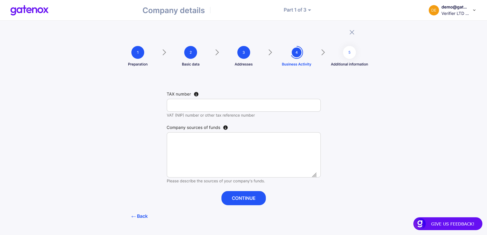
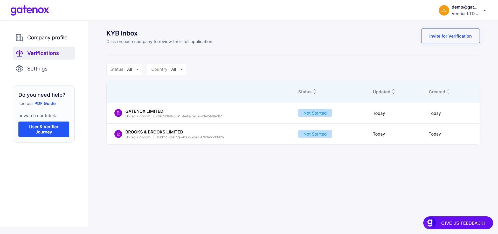
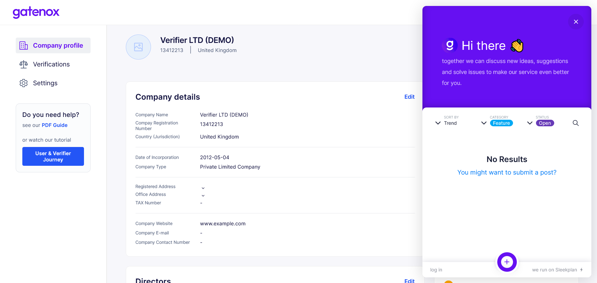

# Guide

## Welcome to the Gatenox wiki!

**Introduction**

1. [Guide](https://docs.gatenox.com/#guide-to-the-gatenox-hub)
2. [Introduction](https://docs.gatenox.com/#introduction)

**User journey**

[Introduction](https://docs.gatenox.com/#onboarding-process-user-journey)

How to create company profile?

1. [Create new company](https://docs.gatenox.com/#creating-new-company)
2. [Add company details](https://docs.gatenox.com/#company-details)
3. [Add directors](https://docs.gatenox.com/#directors)
4. [Create company structure](https://docs.gatenox.com/#company-structure)

How to onboard to partner?

1. [Share your profile with partner](https://docs.gatenox.com/#share-your-profile)
2. [Your current onboardings](https://docs.gatenox.com/#your-current-onboardings)
3. [Other Gatenox partners](https://docs.gatenox.com/#other-gatenox-partners)

**Verifier journey**

[Introduction](https://docs.gatenox.com/#verification-process-verifier-journey)

1. [How to manage incoming reviews](https://docs.gatenox.com/#verification-process-verifier-journey)
2. [Extended individuals and companies verification](https://docs.gatenox.com/#extended-verification)

**Configuration and settigns**

1. [Settings](https://docs.gatenox.com/#settings)
2. [Feedback](https://docs.gatenox.com/#feedback)

## Guide to the Gatenox Hub

This document explains the Gatenox Hub interface and possible usage scenarios.

The application caters to two roles:

* **User** who, while going through the Corporate KYC process, onboards to other companies
* **Verifier** who reviews submitted Corporate KYC applications. As a **Verifier**, you are also a **User**, so you have access both to Verifier and User functionalities. If you'd like to quickly jump into User or Verifier's shoes and see the potential possibilities, check out the [Tutorial Video for both roles](https://beta.gatenox.com/gatenox-beta-video-explainer).

### Introduction

To save you time and maximize your user experience, we have populated your profile with sample company data. For BETA testing, you don't have to worry about filling in these necessary data. Feel free to edit them if you want to get the experience of filling the data in yourself.

The company profile you get out of the box consists of:

* **Company details data** (Jurisdiction, Company Name, Company Registration Number, Date of Incorporation, Company Type, Brand Name, Proof of Incorporation, Registered Address, Office Address, Proof of Office Address, Industry)
* **One Company Director** (and UBO) with KYC data
* **One Individual Shareholder** (the same person as the Director)
* **One Corporate Shareholder**

## Onboarding Process (User Journey)

A significant part of the onboarding process is filling in all your company data required by the company you want to onboard to.

In the Gatenox Hub, the data collection process has been divided into 3 main parts, ie Company Details, Directors, and Company Structure (including UBOs).

Each part has an easy-to-use wizard that guides you throughout the process.

### How to create company profile?

#### Creating new company

To create a new company profile you need to open the context menu in the upper right corner and click on the “Add company” link.

You will see an “Add new company” screen. In order to facilitate the process of creating a new company profile (entering selected data for you), you must specify exactly what company you mean by entering the jurisdiction and number.

Now you can use the “Find your company” button to search for the name of your company. The result will be displayed in the “Company name” field. In case your company will not be found, you can enter “Company name” manually and press the “Continue” button. If the company was not found, then we will not be able to facilitate the process for you.

Now you can press the “Continue” button to go through the company setup wizard. The “Company details” preparation screen will be displayed.

#### Company Details

This part is divided into 5 main steps (some steps contain more than one screen):

* **Preparation** - displays information about the data and documents that are required,
* **Basic Data** - asks data related to incorporation,
* **Addresses** - asks data related to Registered Address and Office Address,
* **Business Activity** - asks data about the nature of your business,
* **Additional Data** - asks about any additional information that may be required.

**Preparation**

**Basic Data > Incorporation Details**

**Basic Data > Proof of Incorporation Details** (upload each document with one click)

**Addresses > Registered Address**

**Addresses > Office Address**

**Basic Data > Proof of Office Address** (upload each document with one click)

**Business Activity > Description**

**Business Activity > Financials**

**Additional Information**

#### Directors

This part is divided into 4 main steps:

1. **Preparation** - displays information about the data and documents that are required
2. **List of Directors** - asks data regarding directors’ basic personal information such as date of birth
3. **Verify your list of directors** - provide a document proofing previously entered list of directors
4. **Verification** - asks Know Your Customer (KYC) data for each director

**Preparation**

**List of Directors > Add Directors**

**List of Directors > Personal Data**

**List of Directors > Verify your list of directors**

**Verification > Personal Data**

**Verification > Address**

**Verification > Identity Verification**

 

#### Company Structure

This part is divided into 4 main steps:

1. **Preparation** - displays information about the data and documents that are required
2. **Shareholders** - asks data regarding the structure of your company (you can build any structure by adding Individual and Corporate shareholders)
3. **UBOs** - displays information regarding UBOs (taken from the company structure)
4. **Verification** - asks data regarding Individual and Corporate shareholders

**Preparation**

**Shareholders**

**UBOs - list**

**UBOs - justification**

**Verification** (add detailed data regarding Individual and Corporate shareholders)

Once the required company data is completed, you will be able to send it to the Gatenox Partner by clicking on the _Send for Review_ button.

When your data has been sent, your application will appear in the _Your Applications_ panel on the Company profile screen.

### How to onboard to partner

#### Share your profile

On the right side of the "your profile" screen, you can find a list of Gatenox partners. To start the onboarding process, click on your chosen partner.

The partner will be added to your current onboarding list. If your profile is completed form the perspective of data required by partner, you will be able to quickly share your profile using the "Send for review" button.

In case additional data is required by partner, a notification will be presented at the top of the screen.

After completing the required informaction, press the "Send for review" button to share your profile with the partner. You will see a list of data which will be sent to the partner.

#### Your current applications

After sending your profile to the partner, the partner name will be displayed in the box on top of the "Your profile" screen. You can switch between partners by choosing a different one from the list.

After clicking on each application, you can preview the application data in the same way as the verifier sees them.

#### Other Gatenox partners

On the right side of the screen, you can find other Gatenox partners who you can onboard to using your existing company profile.

## Verification Process (Verifier Journey)

To review applications, click on the Verifications tab and select one of the applications in the list.

From this screen, you can also send a verification invitation to another company. As soon as the other party accepts your invitation to the Corporate KYC process, the application will appear in the mentioned list.

### Review Process

Each application is divided into 6 main parts:

* **Company Details** - displays all details related to company incorporation data, addresses, etc.
* **Directors** - displays all details related to company directors (including required KYC information)
* **UBOs** - displays all details related to company UBOs (including required KYC information)
* **Company Structure** - displays all shareholders (this part is connected with the company structure graph that you can see at the top of the review page)
* **Identified Issues** - displays all identified potential issues, e.g. presence of company entities or individuals on sanction, PEP or criminal lists
* **Assessment** - section where you can accept or reject the application and include summary notes

Before the mentioned sections are displayed, a summary of any identified potential issues will appear at the top of the page e.g. presence of company entities or individuals on sanction, PEP or criminal lists in **a red section**.

If no potential issues are found, a green section will be displayed at the top of the page.

In addition, you can view the whole structure of the company in the form of a **fully interactive graph** (it is possible to open the graph in a new browser tab).

After having an overview of the company's structure, you can proceed to the process of viewing the data.

**Company Details**

**Directors**

**UBOs**

**Company Structure - tree view** (you can view the entire structure by expanding the selection - in this case, clicking the down arrow next to PETROPARS UK LIMITED)

**Identified issues**

**Assessment**

### Extended verification

The basic sanctions check included as a default involves verification of individuals and companies on the internal sanctions list. This currently only includes the OFAC database.

If you need to verify individuals and companies against a myriad of sanction lists, PEP, and criminal watchlists, you can buy additional search credits by selecting an entity on directors, UBOS and company structure tabs. They will be added to the entity's verification basket on the right side of the webpage.

If you have sufficient credits, when you press the “Verify” button, additional verification will be performed and the results will be presented in the same manner as internal checks.

## Settings

Settings can be accessed using the "Settings" tab on the side menu pane on the left or by clicking on the "Manage your account" button in the upper right corner.

The settings tab consist of 2 tabs:

1. **Account information** - to review and (in the future) update personal data
2. **Company information** - to update company profile information like company logo, services description or referral code

**Account information**

In this section, you can see your individual account details. We plan to add more features in the section shortly.

**Company information** The tab is split into 2 sections:

1. Basic settings:
   * you can upload your company logo that is displayed on the Gatenox Hub
   * you can edit the "About Company" details which is a brief description about your company and its services. It is displayed on the welcome screen and will be displayed to users you invite using your referral code
   * you can also check your credit balance. Credits are used to buy additional services such as extended verification on sanctions and PEP lists or to ask users to provide an external KYC verification. To add more credits, please contact our sales department at sales@gatenox.com.
2. Verification settings:
   * you can customize your verification link
   * you can see the required fields which is mandatory for every user you verify. This data can be configured in the setup phase.

## Feedback

We encourage you to take the opportunity to leave feedback. Click on the blue GIVE US FEEDBACK button pinned to the bottom of the page and leave your opinion.

