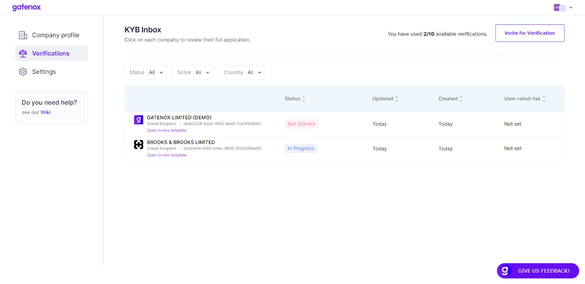

# Cases management

The "Verifications" tab displays a comprehensive index of all incoming reviews. The said tab is equipped with filters positioned above the list to facilitate a search of a particular case. These filters enable you to filter the list based on attributes such as status, user-rated score, and country. Moreover, the list can be sorted out in a specific order, with the default setting being in descending order of the "updated" time attribute.

To initiate the review process, navigate to the Verifications tab and select the desired application from the available list.

<figure><figcaption>
Verifications - list of reviews
</figcaption></figure>
