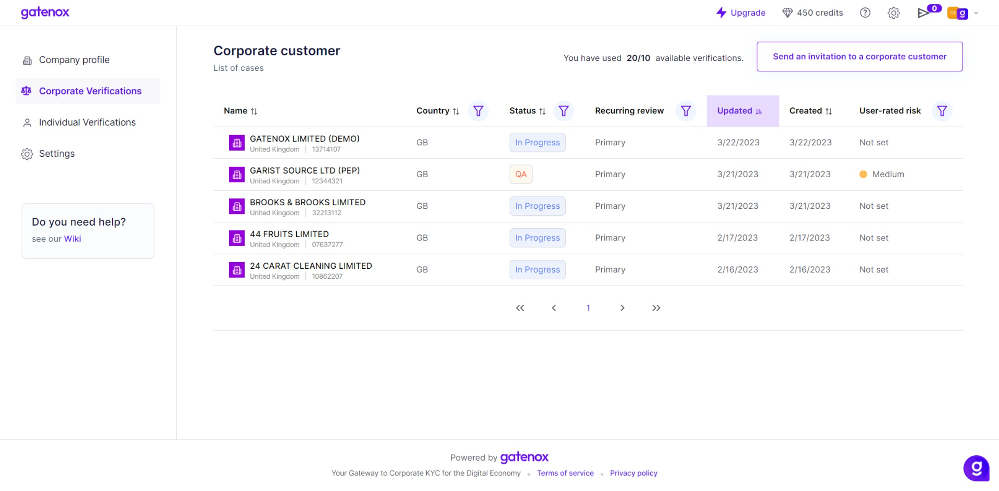
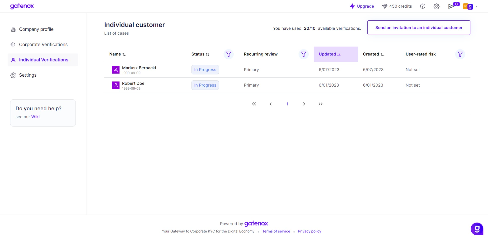

# Cases management

The "Corporate Verifications" and "Individuals Verifications" tabs display a comprehensive index of all incoming reviews.

The process flow of the cases is presented in the graph below.

<figure><figcaption>
Verification workflow
</figcaption></figure>

Both tabs are equipped with filters positioned above the list to facilitate a search of a particular case. These filters enable you to filter the list based on:

* Country - The country where the company is registered or the nationality of the individual.
* User-rated risk - risk score assessed by the Compliance Officer associated with this company/individual,
* Recurring review - this attribute informs the Compliance Officer about the origin of the review:
  * Primary - this is the first case from this company,
  * Recurring - this is a recurring review of the company, which was automatically open after a defined time set in the "Settings" menu,
* Status - current status of the case.

Moreover, the list can be sorted out in a specific order, with the default setting being in descending order of the "Updated" time attribute.

<figure><figcaption>
Corporate verifications - list of reviews
</figcaption></figure>

To initiate the review process, navigate to the Verifications tab and select the desired application from the available list.

<figure><figcaption>
Individual Verifications - list of reviews
</figcaption></figure>
