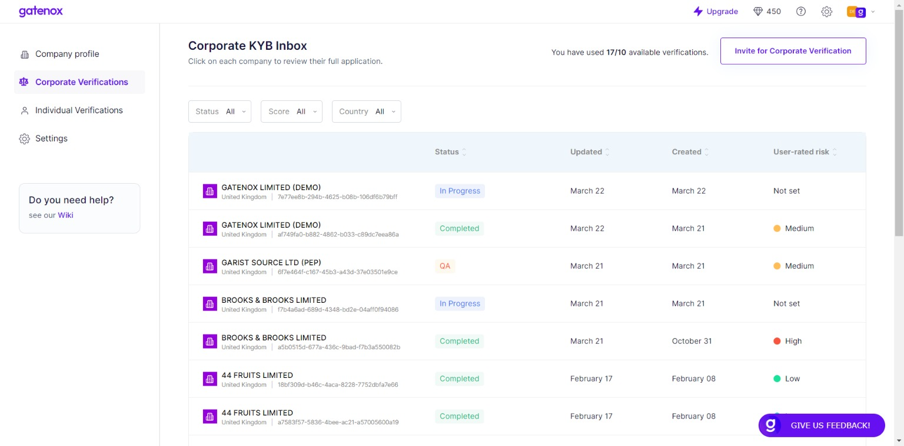
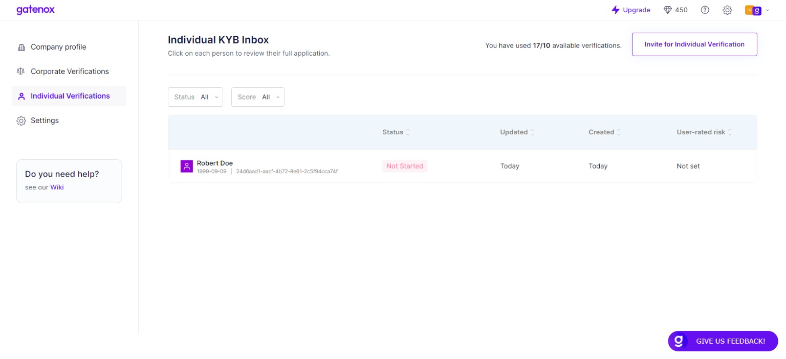

# Cases management

The "Corporate Verifications" and "Individuals Verifications" tabs display a comprehensive index of all incoming reviews. both tabs are equipped with filters positioned above the list to facilitate a search of a particular case. These filters enable you to filter the list based on attributes such as status, user-rated score, and country. Moreover, the list can be sorted out in a specific order, with the default setting being in descending order of the "updated" time attribute.

<figure><figcaption>
Corporate verifications - list of reviews
</figcaption></figure>

To initiate the review process, navigate to the Verifications tab and select the desired application from the available list.

<figure><figcaption>
Individual Verifications - list of reviews
</figcaption></figure>
