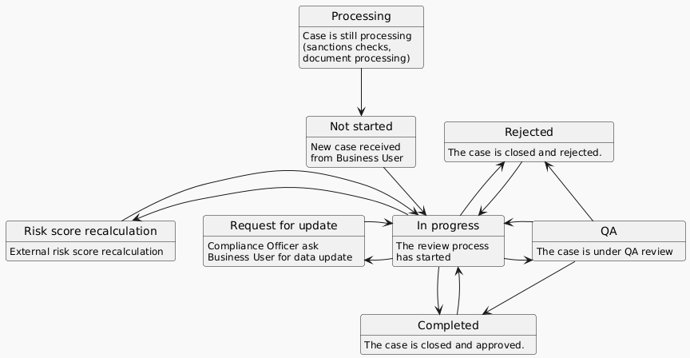

# Corporate verifications

The "Corporate Verifications" tab displays a comprehensive index of all incoming cases related to corporate clients. The company evaluation process (risk assessment) is split into 2 steps.

### Invitation and data-gathering process (onboarding)

Before you receive the case for risk assessment, your client needs to receive an invitation, start the onboarding process, and gather all the information required by your company.

#### How do you send an invitation to the corporate client?

Please follow the guide described here: [send-invitation-for-review.md](../start-onboarding-customers-with-gatenox/send-invitation-for-review.md "mention").

After sending the invitation, it will appear on the "Invitation sent" tab in the "Invited" status. After the customer starts the onboarding process, the stats will change to "Completed" and the new item, with the company name, will appear on the "Clients in progress" tab.


If you sent the invitation via the API endpoint and added the customer\_ID, it will be displayed in the "Name / customer\_ID" column.


<figure><figcaption>
Corporate invitations - invitations sent
</figcaption></figure>

#### How do you check the client's status of the onboarding process?

When the client starts the onboarding process (described here: [invitation-for-verification.md](../../id-node-how-to/i-received-email-from-gatenox/invitation-for-verification.md "mention")), you will be able to find the client's details on the "Clients in progress" tab.

<figure><figcaption>
Clients in progress
</figcaption></figure>

You can check the status of the client's onboarding by clicking on the item on the list.

1. In case **the client has completed all required data**, but did not send the data for verification, the Gatenox Hub will present the information shown on the screen below. The client should follow the guide presented here: [share-company-profile](../../id-node-how-to/share-company-profile/ "mention").

<figure><figcaption>
Onboarding status - the client completed all required data
</figcaption></figure>

2. In case **the client's profile is missing some required data**, the Gatenox Hub will present the information shown on the screen below. The missing data information will be grouped by categories. The client should follow the guide presented here: [complete-required-company-data.md](../../id-node-how-to/share-company-profile/complete-required-company-data.md "mention").

<figure><figcaption>
Onboarding status - the client profile is missing some data
</figcaption></figure>

3. In case **the client has completed all required data and sent the company data for verification,** the client's name will disappear from this list and you will find new cases on the "Compliance verifications" tab.

### Risk assessment process

The process flow of the cases is presented in the graph below.

<figure><figcaption>
Corporate verification workflow
</figcaption></figure>

To initiate the risk assessment process, navigate to the "Corporate verifications" tab. On the "Compliance verifications" tab you can find all incoming cases. Select the case from the available list to assess the risk score related to the company. You can find more information about the risk assessment process here: [risk-assessment](../risk-assessment/ "mention").

<figure><figcaption>
Corporate verifications - list of cases
</figcaption></figure>

The "Compliance verifications" tab is equipped with filters positioned above the list to facilitate a search of a particular case. These filters enable you to filter the list based on:

* Country - The country where the company is registered or the individual's nationality.
* User-rated risk - risk score assessed by the Compliance Officer associated with this company/individual,
* Recurring review - this attribute informs the Compliance Officer about the origin of the review:
  * Primary - this is the first case from this company,
  * Recurring - this is a recurring review of the company, which was automatically open after a defined time set in the "Settings" menu,
* Status - current status of the case.

Moreover, the list can be sorted out in a specific order, with the default setting being in descending order of the "Updated" time attribute.

