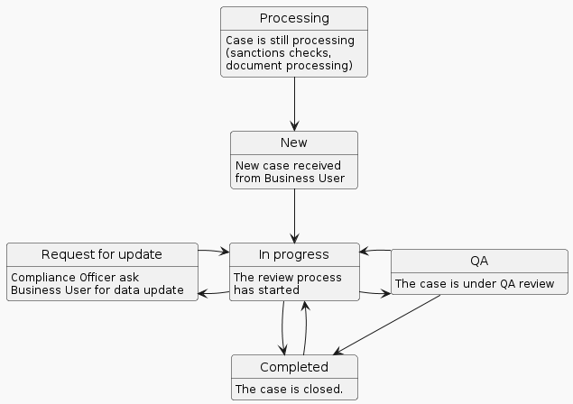

# Individual verifications

The "Individual verifications" tab displays a comprehensive index of all incoming cases related to individual clients. The person evaluation process (risk assessment) is split into 2 steps.

### Invitation and data-gathering process (onboarding)

Before you receive the case for risk assessment, your client needs to receive an invitation, start the onboarding process, and gather all the information required by your company.

#### How to send an invitation to the client?

Please follow the guide described here: [#how-to-send-an-invitation-to-the-client](individual-verifications.md#how-to-send-an-invitation-to-the-client "mention")

After sending the invitation, it will appear on the "Invitation sent" tab.


If you have sent the invitation via the API endpoint and you have added the customer\_ID, it will be displayed in the "Name / customer\_ID" column.


<figure><figcaption>
Individual invitations - invitations sent
</figcaption></figure>

#### How do you check the client's status of the onboarding process?

When the client starts the onboarding process (described here: [invitation-for-kyc.md](../../id-node-how-to/i-received-email-from-gatenox/invitation-for-kyc.md "mention")), you will be able to find the client's details on the "Clients in progress" tab.


When your client partially completes the required data, the Gatenox Hub will display the client's name on the list.


<figure><figcaption>
Individual invitations - lients in progress
</figcaption></figure>

In case **the client has completed all required data and sent the data for verification,** the client's name will disappear from this list and you will find new cases on the "Compliance verifications" tab.

### Risk assessment process

The process flow of the cases is presented in the graph below.

<figure><figcaption>
Individual verification workflow
</figcaption></figure>

To initiate the risk assessment process, navigate to the "Individual verifications" tab. On the "Compliance verifications" tab you can find all incoming cases. Select the case from the available list to assess the risk score related to the company. You can find more information about the risk assessment process here: [risk-assessment](../risk-assessment/ "mention").

<figure><figcaption>
Individual verifications - list of cases
</figcaption></figure>

The "Compliance verifications" tab is equipped with filters positioned above the list to facilitate a search of a particular case. These filters enable you to filter the list based on:

* User-rated risk - risk score assessed by the Compliance Officer associated with this company/individual,
* Status - current status of the case.

Moreover, the list can be sorted out in a specific order, with the default setting being in descending order of the "Updated" time attribute.
