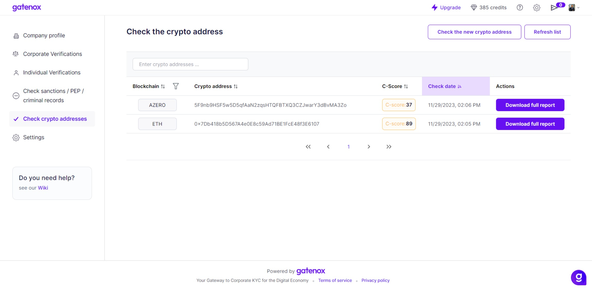
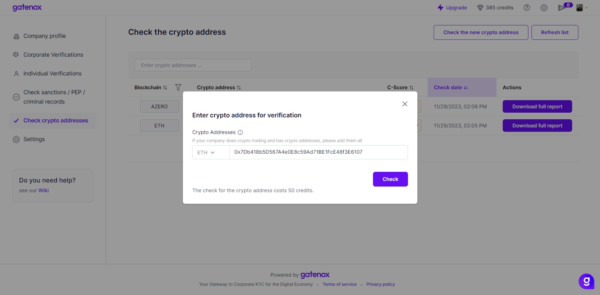
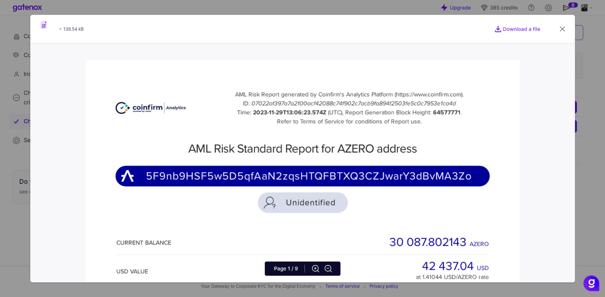

# Check crypto addresses

The "Check Crypto Addresses" feature is a security and compliance tool that allows users to verify the risk level associated with cryptocurrency addresses by cross-referencing them against databases of known risk indicators and reports of illicit activity.

We are analyzing blockchain addresses to detect potential exposure to illicit activities like fraud, money laundering, or connections with sanctioned entities.

<figure><figcaption>
Check crypto addresses - list view
</figcaption></figure>


**Understanding the results**

* The results will present an overview of the risk associated with the address, categorizing it into different levels such as Low, Medium, or High.


### Request for crypto address report

To request for crypto address report:

1. Click the "Check the new crypto address" button.
2. Provide a blockchain and enter crypto addresses.
3. For some crypto addresses the existence on the blockchain of the crypto address will be checked.
4. Press the "Check" button" to start the analysis.

<figure><figcaption>
Check crypto addresses - request for verification
</figcaption></figure>


You will be redirected back to the crypto address report list. All the filters will be clear and you can find your newly requested report at the top.


After the report generation is finished, the information about the risk score associated with the crypto address will be displayed. Click on the item on the list to display the report. You can download the report using link in the top right corner of the modal.

<figure><figcaption>
Check crypto addresses - report
</figcaption></figure>
