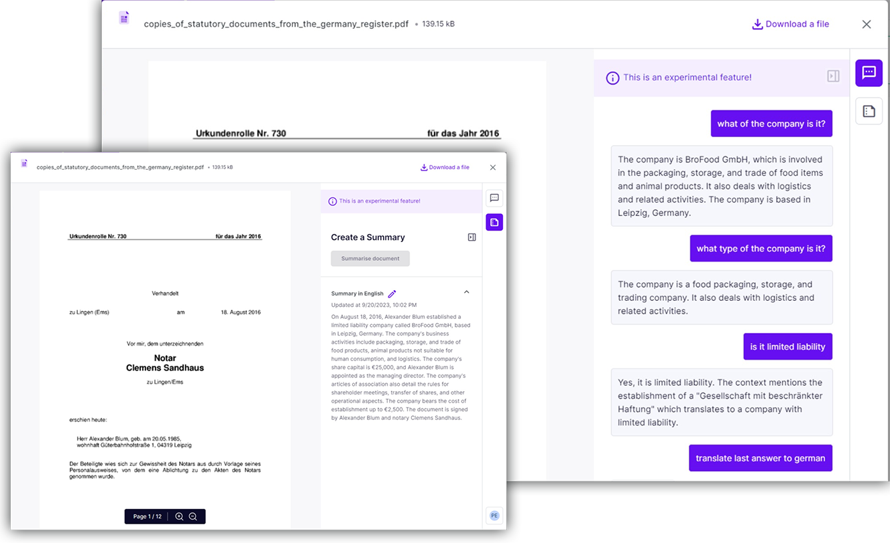

# Document AI (coming soon ...)

Designed exclusively for compliance officers and teams, the "Document AI" feature is a sophisticated compliance-focused tool that empowers you to quickly interpret and analyze regulatory documents through advanced AI technology. Simply upload any compliance-related document, pose your questions, and receive targeted, relevant answers that facilitate rapid understanding and decision-making.

This AI-driven solution streamlines the document review process, ensuring you extract essential compliance information efficiently while enhancing accuracy and oversight. With tailored functionality to address the specific needs of compliance workflows, this tool is crucial for keeping pace with the ever-evolving landscape of regulations and compliance requirements.

<figure><figcaption>
Document AI
</figcaption></figure>

