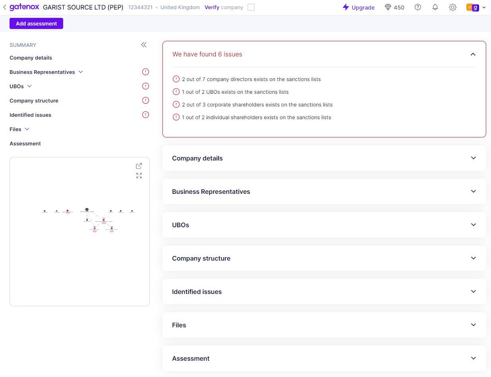

# Risk assessment

The risk assessment screen comprises several distinct sections. The top bar features a "Back" button, along with the name, number, and jurisdiction of the reviewed company. Additionally, a "Verify company" checkbox is present, enabling the execution of enhanced due diligence by cross-checking with extended sanctions lists. The top bar also displays pertinent details regarding the user's plan and available credits (more information: [company-information.md](../../general-settings/company-information.md "mention")).

Further, the top bar includes links to essential features, including notifications, settings, and context changes. The left side of the screen contains links to various review sections, along with a small version of the company structure graph for added reference.

The main component of the review screen displays the data set, as per the user's defined requirements ([what-data-my-company-requires.md](../start-onboarding-customers-with-gatenox/what-data-my-company-requires.md "mention")).

<figure><figcaption>
The review screen
</figcaption></figure>

Each case is organized into eight primary components as follows:

* **Summary**: This section displays a list of issues related to the application, which Gatenox Hub has identified. The issues may include the outcome of sanctions checks, data inconsistencies, or other relevant information related to the review assessment.
* **Company Details**: This section provides all details related to the company's incorporation data, addresses, and other pertinent information.
* **Business Representatives**: This section displays all details related to the company's directors, including any necessary KYC information.
* **UBOs**: This section displays all details related to the company's ultimate beneficial owners (UBOs), including any required KYC information.
* **Company Structure**: This section displays all shareholders, with this component connected to the company structure graph visible at the top of the review page.
* **Identified Issues**: This section highlights any identified potential issues, such as the presence of company entities or individuals on sanctions, PEP, or criminal lists.
* **Files**: This section displays all company-related files attached to the review.
* **Assessment**: This section enables the user to accept or reject the application and include summary notes as needed.


The visibility of certain sections may be dependent on the user's specific data set requirements. Therefore, some sections may not be visible.

