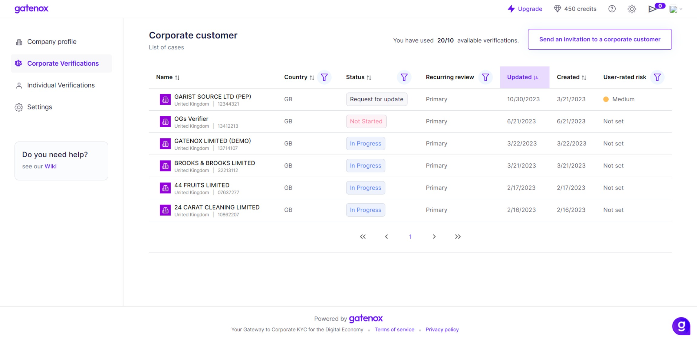

# Ask for data update

On the review screen, Compliance Officers can find the "Ask for data update" button. This button serves as a direct link to initiate a request for updated information from the Business User.

<figure><figcaption>
Review screen - ask for data update
</figcaption></figure>

**Ask for Data Update Button -** clicking on this button triggers a change in the review status from "In Progress" to "Request for Update." This signifies to the Business User that additional information or updates are needed.

The status change is instrumental in clearly indicating the stage of the review process. "Request for Update" flags the specific cases requiring additional attention.

<figure><figcaption>
Corporate verification - request for data update
</figcaption></figure>

Following the Business User's response and update of the profile, the status reverts to "In Progress," and the "Last Update" field is automatically populated with the date and time of the latest update.
