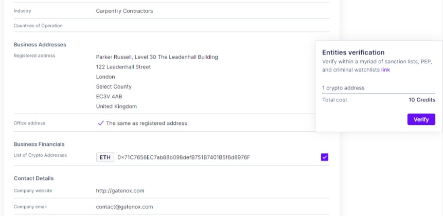
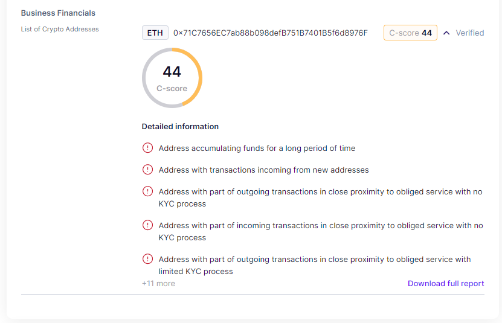

# Company details

### Company details section

The "Company Details" section is an essential component of the review process, containing a wealth of pertinent information related to the company under review. This section comprises details such as company registration data, including any registration numbers, incorporation dates, and legal entity types.

In addition, the section includes information on the company's registered addresses and other contact information, such as email addresses, phone numbers, and website links.

Moreover, the "Company Details" section may contain documents related to the company, such as  shareholder agreements or proof of address. All of this information serves to provide a comprehensive picture of the company under review and forms a crucial part of the overall assessment process.

Next to each field there is a menu allowing Compliance Officer to start conversation with User - ask questions about the review data. Please find our more here: [in-app-communication-tool.md](../in-app-communication-tool.md "mention").


The visibility of certain data may be dependent on the user's specific data set requirements. Therefore, some information may not be visible.


<figure><figcaption>
Review - company details
</figcaption></figure>

### Crypto address verification

Within this section, users can access a list of crypto addresses (if required) associated with the company under review. Each address can be verified by selecting the corresponding checkbox and adding it to the verification basket. Upon clicking on the "Verify" button, a request for the report will be initiated.


Please note that the report generation process may take a few seconds to complete. Please refresh the screen to get the report.


<figure><figcaption>
Review - crypto address verification
</figcaption></figure>

Upon refreshing the screen, users should be presented with the crypto address score and a description of the associated risk. If a full report is required, users can access it by clicking on the "Download Full Report" link.

<figure><figcaption>
Review - crypto address verification result
</figcaption></figure>
