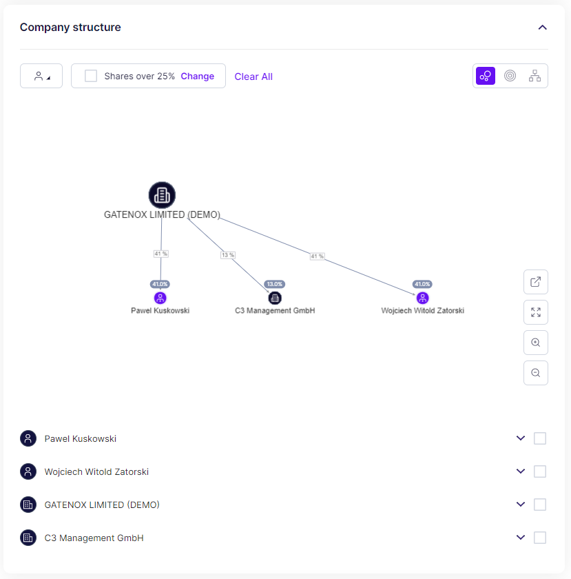
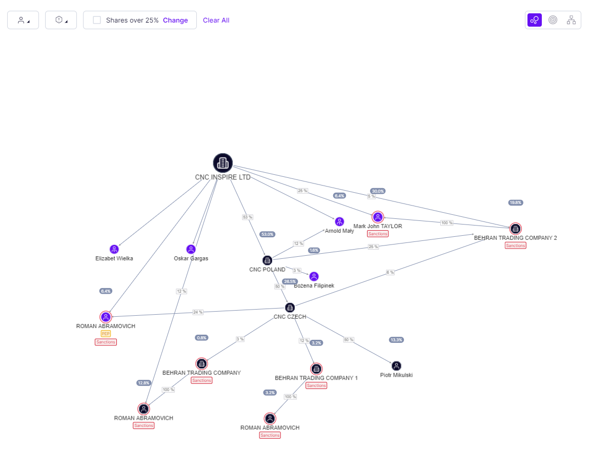

# Company structure

The "Company Structure" section presents a list of both individual and corporate shareholders associated with the company under review. Users can access additional details of each entity in the company structure by scrolling down below the graph. The information presented alongside each entity is tailored to the user's specific data set requirements.

Furthermore, users have the option to conduct enhanced due diligence on each individual and corporate shareholder listed within this section ([entities-verification.md](entities-verification.md "mention")).

<figure><figcaption>
Review - company structure
</figcaption></figure>

### Entities on the graph

The result of entity screening is shown on the graph as a different color.

#### Business representatives:

<figure><figcaption>
the result of individual verification - business representatives
</figcaption></figure>

#### UBOs

<figure><figcaption>
The result of individual verification - UBOs
</figcaption></figure>

#### UBOs and business representatives

If someone has both roles the the following icons might be presented:

<figure><figcaption>
The result of individual verification - UBOs and business representative
</figcaption></figure>

#### Companies

<figure><figcaption>
The result of company verification
</figcaption></figure>

The example of different types of entities on the graph are shown on the picture below.

<figure><figcaption>
Graph with different types of entities
</figcaption></figure>
