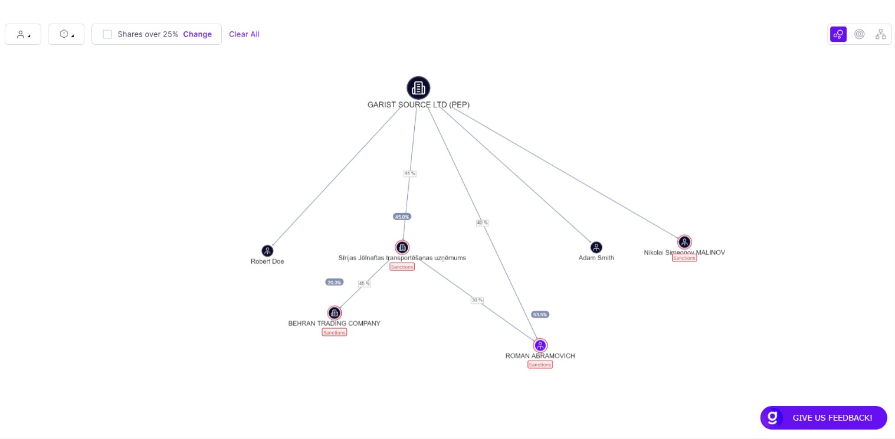

# Company structure

The "Company Structure" section presents a list of both individual and corporate shareholders associated with the company under review. Users can access additional details of each entity in the company structure by scrolling down below the graph. The information presented alongside each entity is tailored to the user's specific data set requirements.

Furthermore, users have the option to conduct enhanced due diligence on each individual and corporate shareholder listed within this section ([entities-verification.md](entities-verification.md "mention")).

<figure><figcaption>
Review - company structure
</figcaption></figure>

### Entities on the graph

The result of entity screening is shown on the graph as a different color.

#### Business representatives:

<figure><figcaption>
the result of individual verification - business representatives
</figcaption></figure>

#### UBOs

<figure><figcaption>
The result of individual verification - UBOs
</figcaption></figure>

#### UBOs and business representatives

If someone has both roles the the following icons might be presented:

<figure><figcaption>
The result of individual verification - UBOs and business representative
</figcaption></figure>

#### Companies

<figure><figcaption>
The result of company verification
</figcaption></figure>

The example of different types of entities on the graph are shown on the picture below.

<figure><figcaption>
Graph with different types of entities
</figcaption></figure>

### Company ownership

The company shareholder graph with % of share for each shareholder is a visual representation of the ownership structure of a company. The graph shows the percentage of shares owned by each individual or corporate shareholder.

This feature provides insight into the distribution of ownership among the stakeholders of the company. It enables stakeholders to understand the concentration of ownership and the extent to which power is held by a particular shareholder or group of shareholders.

In addition to the direct shareholders' percentages displayed in white, the shareholder graph with % of share may also include the total (indirect) ownership percentage represented in grey. This information provides a more complete picture of the ownership structure by including not only the direct shareholders but also any indirect shareholders who own shares through intermediary entities, such as investment funds or holding companies.

The grey color represents the total percentage of shares owned by both direct and indirect shareholders, highlighting the influence that indirect ownership can have on the company. The inclusion of indirect ownership in the graph helps stakeholders to understand the full extent of ownership concentration and potential voting power.

By displaying both direct and indirect ownership percentages, the shareholder graph with % of share provides a comprehensive view of the ownership structure and helps stakeholders make informed decisions based on a more complete picture of the company's ownership landscape.
