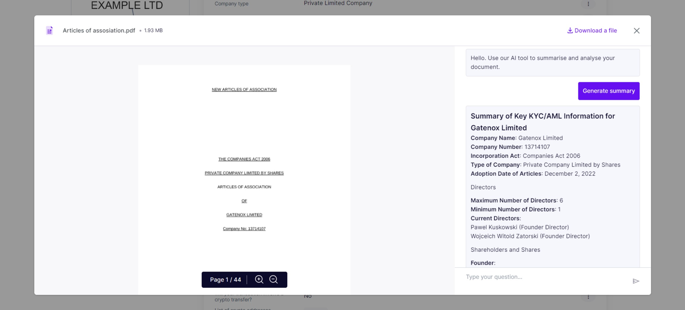
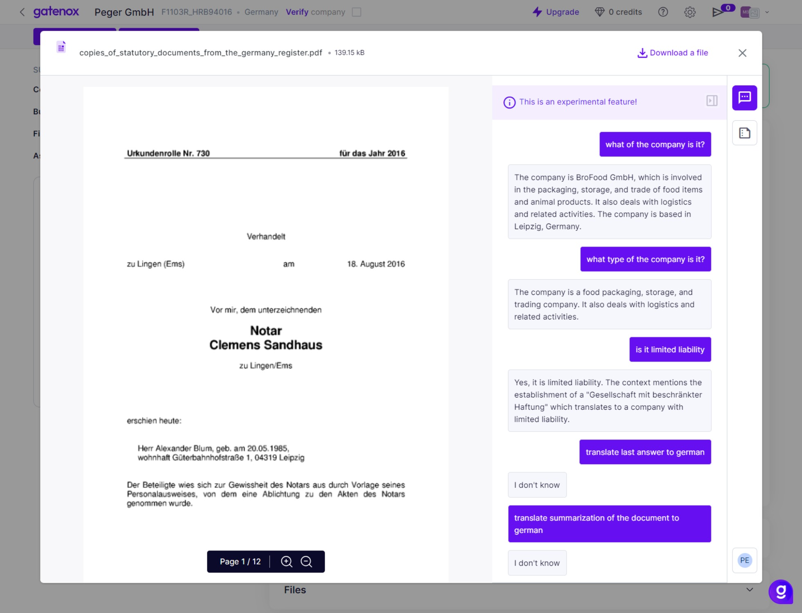

# Document AI

Unleash the potential to effortlessly summarize complex documents, seamlessly translate content, ask targeted questions, and pinpoint review data. With Gatenox, harness the power of AI for a smarter and more efficient document management experience.

<figure><figcaption>
Document AI - summary
</figcaption></figure>

With the "Document AI" feature the Compliance Officer can:

1. Summarize Document: Document AI in Gatenox leverages advanced algorithms to distill the key information from your documents, providing concise and insightful summaries.
2. Translate document: Gatenox's Document AI seamlessly translates documents, breaking down language barriers and enabling effective communication across diverse audiences.
3. Find review data in the document: Gatenox Document AI is equipped to efficiently locate and extract review-related data within documents, enhancing the accuracy and speed of information retrieval for comprehensive analysis.
4. Ask a question to the document: Gatenox Document AI enables users to pose specific questions to documents, extracting relevant information and streamlining the search for precise answers.

<figure><figcaption>
Document AI - ask questions
</figcaption></figure>
