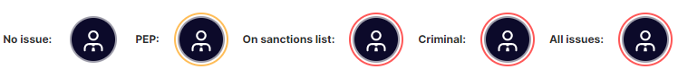
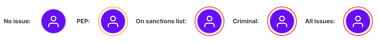

# Entities verification

### Internal sanctions check

Upon opening a review, Gatenox Hub performs a verification of entities against internal databases. The outcome of the sanctions screening is displayed in the "Summary" section of the review.

<figure><figcaption>
Review details - sanctions found
</figcaption></figure>


Pay attention to records displayed in this section - it depends on you if the result is relevant for your business or not.


### Enhanced due diligence on individuals and companies

Gatenox Hub can perform enhanced due diligence, which involves checking the company and its related entities against a broad range of databases. These may include international sanctions lists, Politically Exposed Persons (PEP) databases, and global watchlists for individuals and entities with a history of financial crime or money laundering. The results of this enhanced screening will be displayed in the relevant sections of the review, allowing for a more comprehensive assessment of potential risks associated with the company and its stakeholders.

To verify a specific entity, the user can select the checkbox next to the entity's name, which adds the verification request to the basket. Clicking the "Verify" button in the cart will initiate the verification process and display the results in the review section.

<figure><figcaption>
Review - get enhanced verification of individual
</figcaption></figure>

### Individuals tags and the identified issues section

The outcomes of the entity verification will be displayed in the "Business representatives", "UBOs", and "Identified issues" sections. Every entity can be classified as:

* Sanctions: The entity (individual or corporate) has been identified on sanctions lists.
* PEP: The individual has been found in the Politically Exposed Persons (PEP) database.
* Criminal: The entity has criminal records.

<figure><figcaption>
Review - sanctioned individuals
</figcaption></figure>

### The graph&#x20;

The result of the entity due diligence is shown on the graph with different colors and icons. Below the graph, entities that have been marked as sanctioned, PEP, or have criminal records will be displayed in a similar way to the "Identified issues" section.&#x20;

<figure><figcaption>
Review - issues presented on graph
</figcaption></figure>

#### Business representatives:

<figure><figcaption>
the result of individual verification - business representatives
</figcaption></figure>

#### UBOs

<figure><figcaption>
The result of individual verification - UBOs
</figcaption></figure>

#### UBOs and business representatives

If someone has both roles the the following icons might be presented:

<figure><figcaption>
The result of individual verification - UBOs and business representative
</figcaption></figure>

#### Companies

<figure><figcaption>
The result of company verification
</figcaption></figure>
