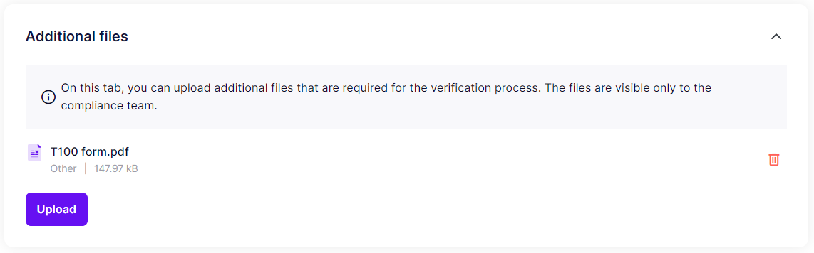

# Additional files

The "Additional files" section contains all the additional documents and files associated with the case uploaded by the compliance team.

The documents in the section are only visible to the compliance team.


The visibility of certain data may be dependent on the user's specific data set requirements. Therefore, some information may not be visible.


<figure><figcaption>
Review - files
</figcaption></figure>
