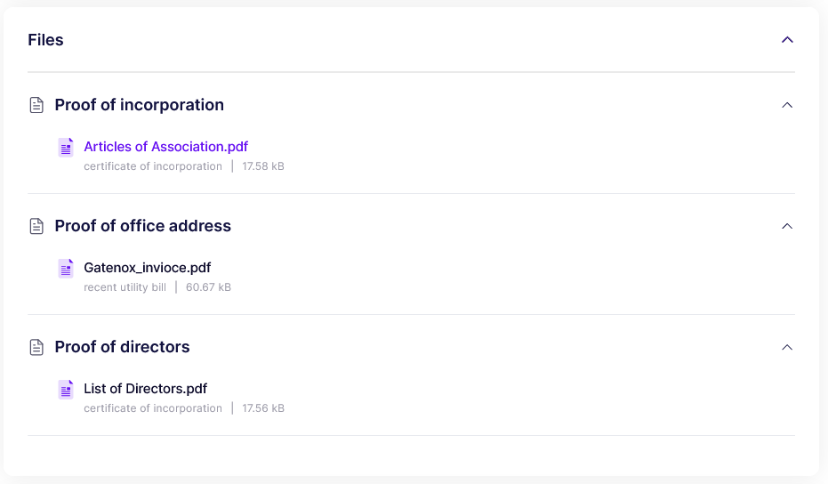

# Files

The "Files" section contains all the relevant documents and files associated with the case. These documents may include proof of registration data, such as company agreements, proof of addresses, and lists of directors and other individuals related to the company.

This section allows users to easily access and review all relevant documents and files associated with the application. By thoroughly examining these documents, users can verify the accuracy and authenticity of the information provided and make informed decisions regarding the acceptance or rejection of the application.


The visibility of certain data may be dependent on the user's specific data set requirements. Therefore, some information may not be visible.


<figure><figcaption>
Review - files
</figcaption></figure>
