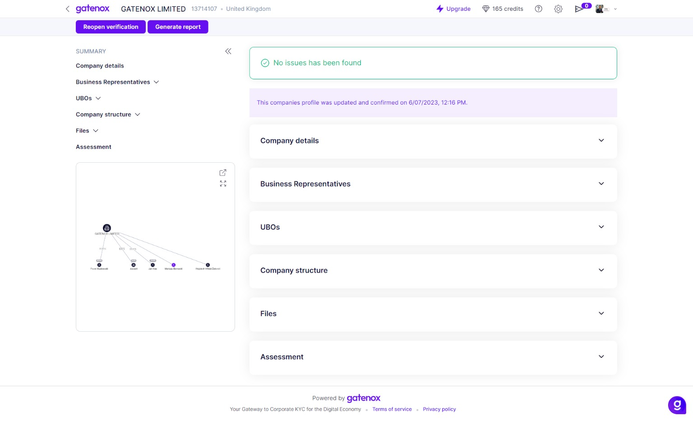
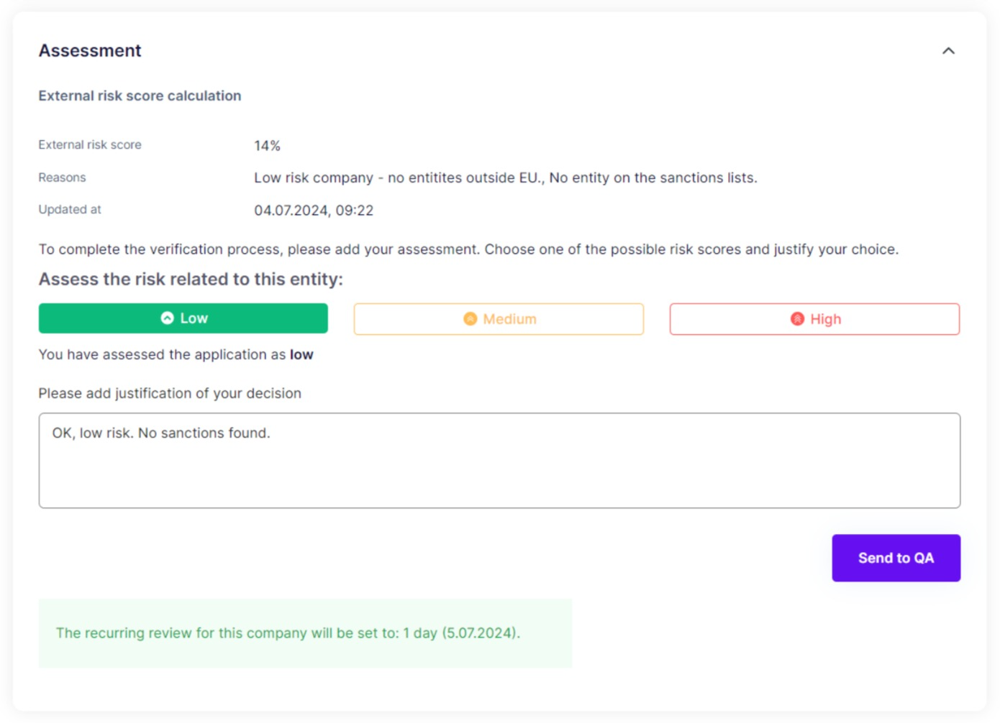
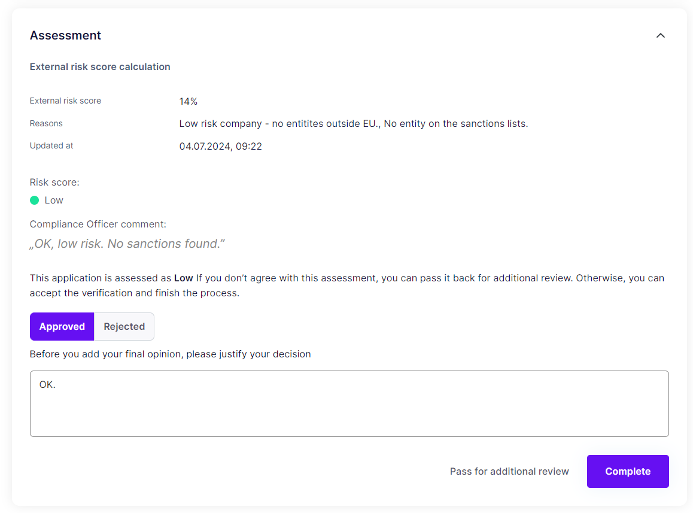
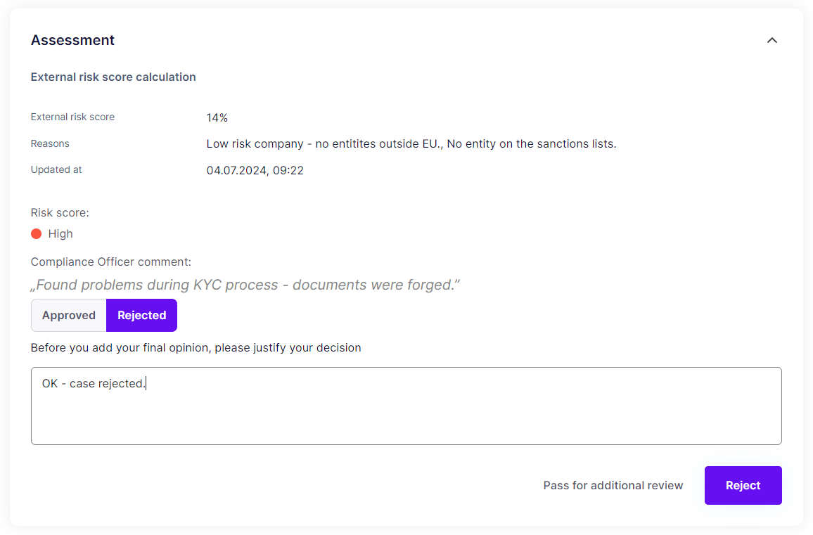

# Final assessment

### Assessment without QA

The final section of the review provides a comprehensive risk management feature that empowers the user to assign a risk score to the company.

The risk scoring methodology must be aligned with your company's unique risk assessment policies.

First, you have a choice to approve or reject the case. After providing the user-rated risk score associated with the company or individual, The Gatenox Hub will display the planned date of the recurring review. On this date in the future, the new case will be automatically opened for review.

<figure><figcaption>
Review - assessment without QA
</figcaption></figure>

Once the review process is completed, the case will be marked as "Completed." or "Rejected according to your final decision.

At the end of the assessment, the user has the option to generate a PDF report with all the information from the review for future reference.

In some cases, you may need to reassess the risk score. To reopen a case, the user can simply click on the "Reopen Verification" button.

<figure><figcaption>
Review - generate PDF report
</figcaption></figure>

### Assessment with QA

Based on your configuration, the review can either be moved to "QA" status and will require another compliance officer to check it.

<figure><figcaption>
Review - assssment with QA
</figcaption></figure>

At this point, the other compliance officer has the option to either confirm your assessment (approve or reject the review) or return the case to analysis with comments.

To approve the case, select "Approved" and provide a comment.

<figure><figcaption>
Review - approve the case
</figcaption></figure>

To reject the case, select "Rejected" and provide a comment.

<figure><figcaption>
Review - reject the case
</figcaption></figure>

To pass the case back to analysis, press the "Return to analysis" button, provide the comment and confirm.

<figure><figcaption>
Review - QA comment
</figcaption></figure>

If you want to add the final assessment, follow the description presented above [#assessment-without-qa](final-assessment.md#assessment-without-qa "mention").
