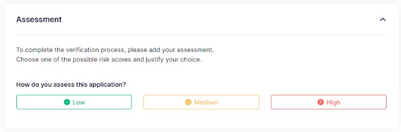

# Final assessment

The final section of the review provides a comprehensive risk management feature that empowers the user to assign a risk score to the company.

The risk scoring methodology must be aligned with your company's unique risk assessment policies.

<figure><figcaption>
Review - assessment
</figcaption></figure>

Based on your configuration, the review can either be moved to "QA" status and will require another compliance officer to check it. At this point, the other compliance officer has the option to either confirm your assessment, return the case to analysis with comments, or approve the review.&#x20;

Once the review process is completed, the case will be marked as "Completed."

At the end of the assessment, the user has the option to generate a PDF report with all the information from the review for future reference.

In some cases you may need to reassess the risk score. To reopen a case, the user can simply click on the "Reopen Verification" button.

<figure><figcaption>
Review - generate PDF report
</figcaption></figure>
