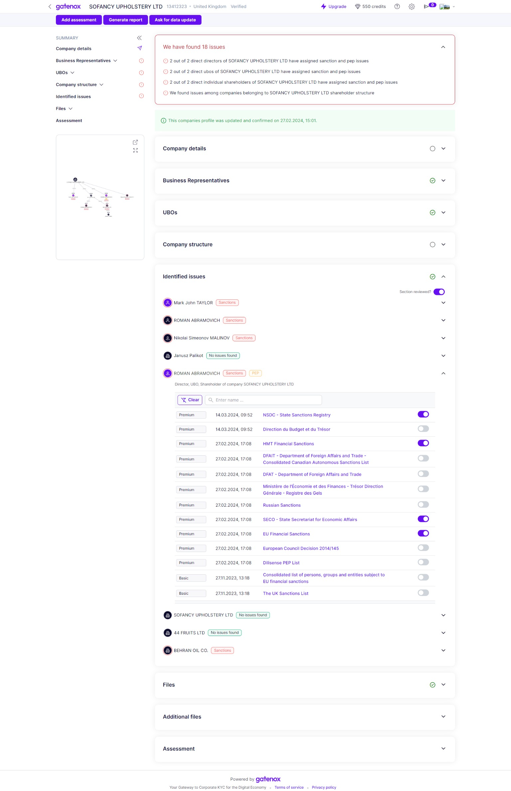

# Identified issues

The "Identified Issues" section comprises a list of entities, both individuals and corporations, which have been screened for sanctions, politically exposed persons (PEP), and criminal records. This list includes a link to detailed records for each entity, allowing users to view and assess the potential risks associated with the entity.

The information presented within this section is intended to aid users in identifying any potential issues associated with the entities under review. By thoroughly examining this information, users can make informed decisions regarding the acceptance or rejection of the application.

Some of the check results may be irrelevant to your case - for example, a sanction list does not apply to your country. You have the option to mark them as irrelevant during the review process.

<figure><figcaption>
Review - identified issues
</figcaption></figure>
