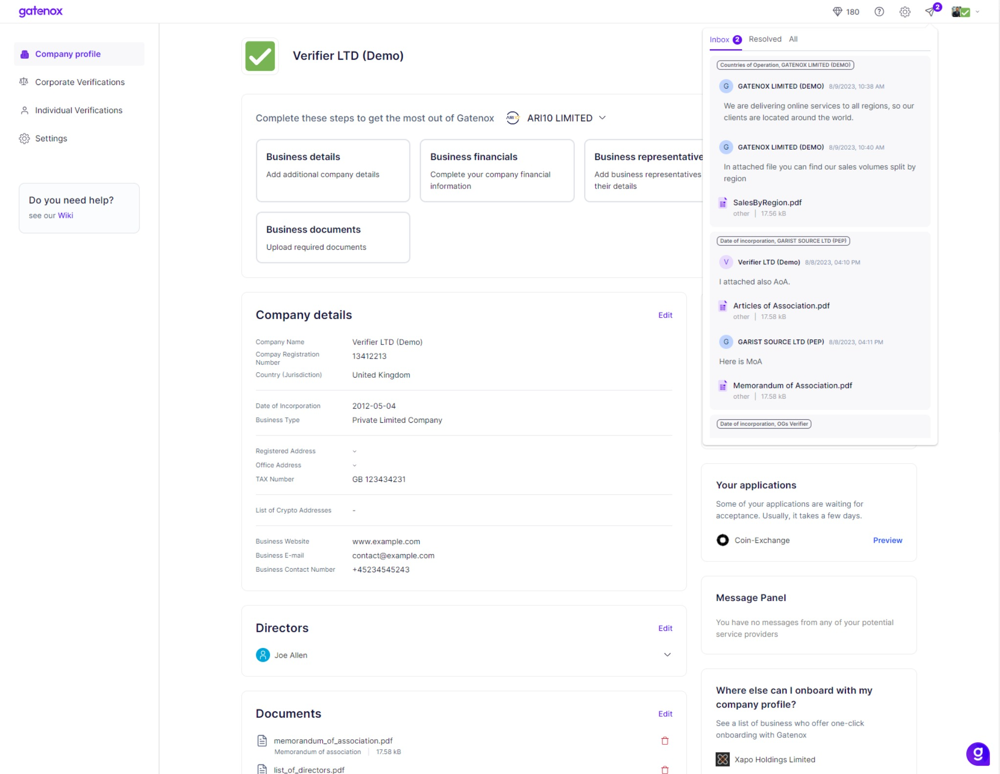
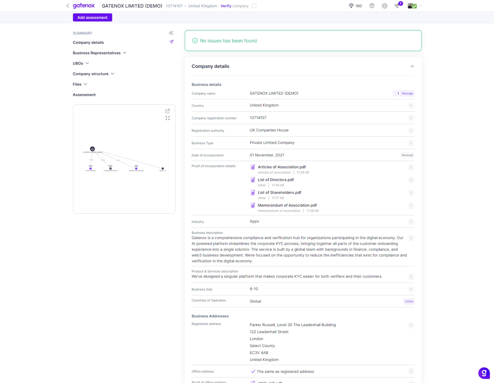
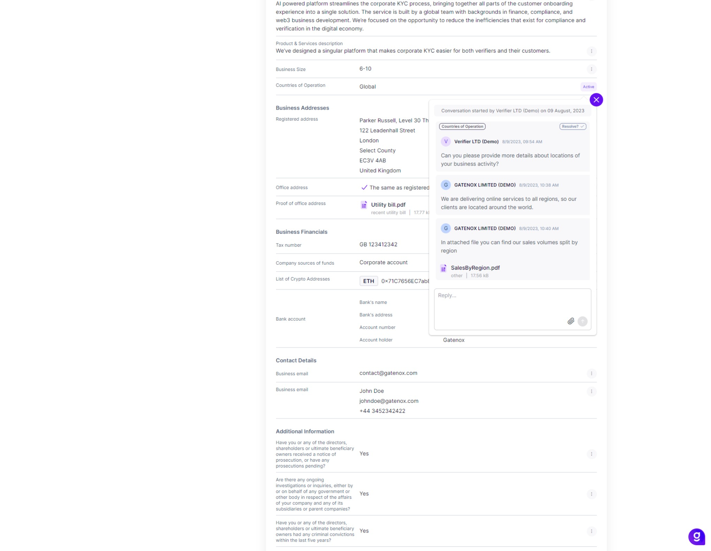

# In-App Communication Tool

In Gatenox Hub, we offer a powerful in-app communication tool designed exclusively for Compliance Officers. This tool facilitates effective and secure communication between Compliance Officers and Users throughout the onboarding process. This guide outlines the features and functionalities to help Compliance Officers navigate this tool seamlessly.

<figure><figcaption>
In-app communication tool - incoming messages
</figcaption></figure>

### **Key Features of the in-app communication tool**

Key features of the in-app communication tool:

* **Ask questions:** Compliance Officers have the capability to initiate new conversations with users and ask questions about data provided in the onboarding form. These questions are essential for clarifying details, requesting additional information, or asking users to attach relevant files.
* **Receive User Responses:** Compliance Officers receive notifications when users respond to questions about data submitted during the onboarding process. This ensures a streamlined feedback loop and smooth communication.
* **Interactive Redirection:** Clicking on a notification within the notification center will redirect Compliance Officers to the relevant review page. This page offers a distinct view optimized for communication with users.
* **Status Labels:** Each field in the review section is accompanied by status labels, including:
  * **Unread Messages:** If there are unread messages, the label will display the number of unread messages, e.g., "(2) Messages",
  * **Active Conversation:** If an ongoing conversation exists without unread messages, the label will indicate "Active",
  * **Resolved Topic:** When a topic has been successfully resolved, the label will show "Resolved".

<figure><figcaption>
In-app communication tool - messages statuses
</figcaption></figure>

### **Engaging in Conversations**

Within the conversation window, Compliance Officers can effectively interact with users. Here's what you can do:

* **Initiate Queries:** Start new conversations by posing questions or requesting additional information from users. This aids in obtaining comprehensive and accurate data during the onboarding process.
* **Receive User Responses:** Receive responses from users regarding questions posed during the onboarding process. This real-time feedback helps in resolving queries promptly.
* **Closing Conversations:** If the required information is received and the conversation is no longer needed, Compliance Officers can mark it as "resolved." This helps in keeping track of active and completed conversations.

<figure><figcaption>
In-app communication tool - review User's answer
</figcaption></figure>

The in-app communication tool is an invaluable asset that enhances communication and collaboration between Compliance Officers and users. It streamlines the onboarding process by ensuring clear dialogues, thus contributing to accurate and efficient data submission.
