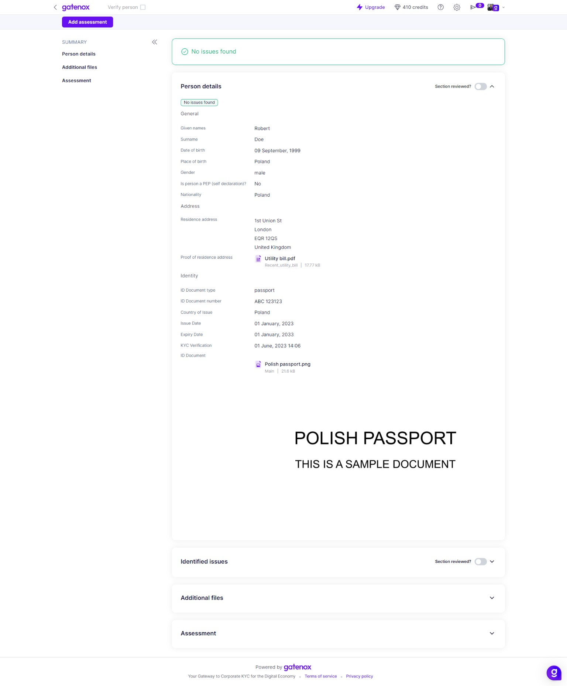

# Personal details

The "Personal Details" section is an essential component of the review process for individuals, containing a wealth of pertinent information related to the individual under review. This section comprises personal details, residence address and identity data.&#x20;

On the "Personal details" tab you can find a label representing the result of the screening process: No issues found, Sanctions, PEP (politically exposed person), Criminal records and Adverse media. After clicking on the label you will be redirected to the "Identified issues" tab, where details are shown [identified-issues.md](identified-issues.md "mention").


The visibility of certain data may be dependent on the user's specific data set requirements. Therefore, some information may not be visible.


<figure><figcaption>
Review - personal details
</figcaption></figure>
