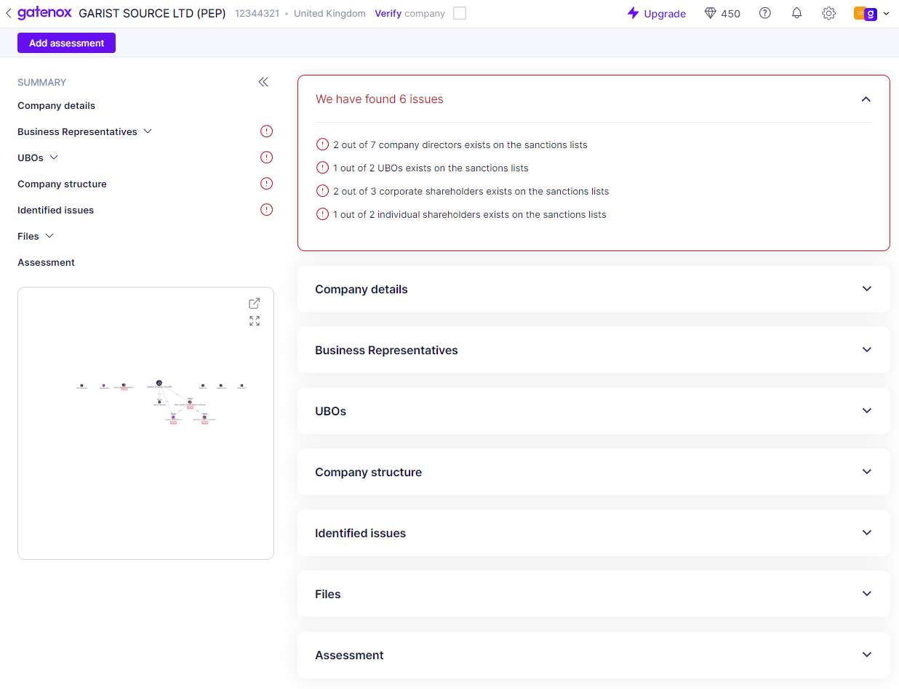

# Summary

A <mark style="color:red;">red-colored</mark> section located at the top of the review screen will display a summary of any potential issues that have been identified, such as the presence of company entities or individuals on sanctions, PEP, or criminal lists.


The visibility of this section is contingent upon the outcome of sanctions screening. If nothing is found during the screening process, the section will be hidden from the view.


<figure><figcaption>
Review - Gatenox Hub found issues
</figcaption></figure>
