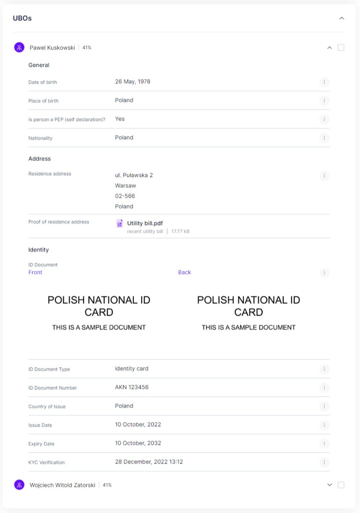

# UBOs

The "UBOs" section provides a list of ultimate beneficial owners of the company under review. The information displayed alongside each person is presented in accordance with the user's specific data set requirements.

Furthermore, users can conduct enhanced due diligence on each person listed within this section ([entities-verification.md](entities-verification.md "mention")).


The visibility of certain data may be dependent on the user's specific data set requirements. Therefore, some information may not be visible.


<figure><figcaption>
Review - UBOs
</figcaption></figure>
