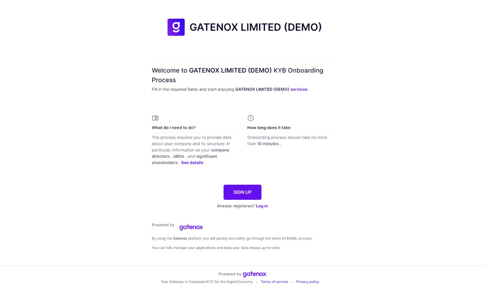

# Referral code

Each verifier receives a dedicated referral code which is used to quickly redirect the customer to Gatenox and start the onboarding process.

### Where is my referral code?

The referral code is generated automatically after a new company is created. It can be found in the "Settings" menu under the "Company information" tab.

<figure><figcaption>
Settings - company information, referral code
</figcaption></figure>

Your code consists of randomly generated letters and digits. If you prefer you can change the code to better fit your requirements, for example: company name.

### Where referral code is used?

The referral code (with a link to Gatenox Hub) is used in:

1. Invitation emails ([send-invitation-for-review.md](send-invitation-for-review.md "mention"))
2. "Apply via Gatenox" button or link ([apply-via-gatenox.md](apply-via-gatenox.md "mention"))

### What will my customer see after clicking on the referral link?

Customers will be redirected to the welcome page after clinking on the link/button with your referral code. The information about your onboarding process and your services will be displayed, along with the "Sign up" / "Login" to the Gatenox Hub button.

After logging in to Gatenox your company will be automatically added to the customer's current onboarding list.

<figure><figcaption>
Invitation for corporate verification
</figcaption></figure>
