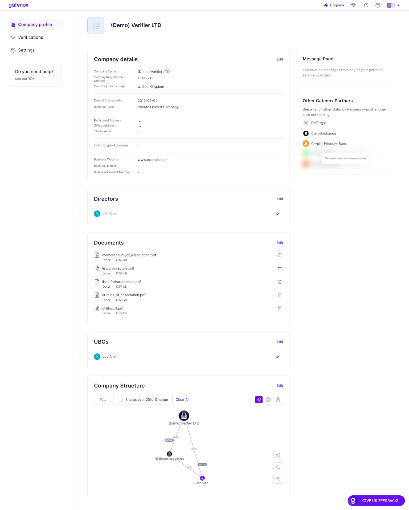
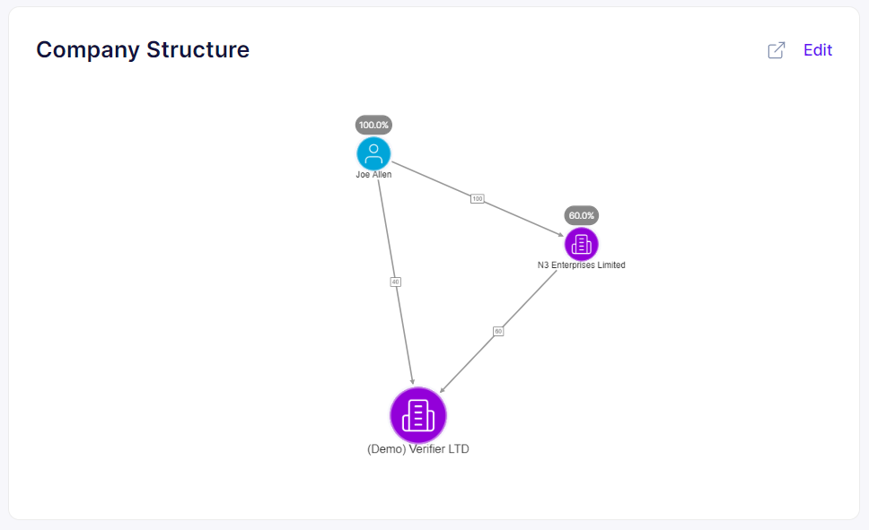
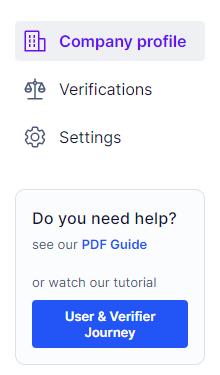

# Example data - overview

To save you time and maximize your user experience, we have populated your profile with sample company data. For testing, you don't have to worry about filling in these necessary data. Feel free to edit them if you want to fill in the data yourself.

The company profile provided of the box consists of:

* **Company details data** (Jurisdiction, Company Name, Company Registration Number, Date of Incorporation, Company Type, Brand Name, Proof of Incorporation, Registered Address, Office Address, Proof of Office Address, Industry)
* **One Company Director** (and UBO) with KYC data
* **One Individual Shareholder** (the same person as the Director)
* **One Corporate Shareholder**

Here you can find a description of sample data that has been provided to user and verifier profile on the sandbox environment.

1. Log in to the application using the login information you received in the email.
2.  After logging in, you will hit your company profile screen. We have prepared a profile of the company named **Verifier LTD** for you. As you can see in the following screenshot, the profile contains several sections related to the Verifier LTD company details (_Company Details, Directors, Documents, UBOs, Company Structure_) and _Message Panel_, and _Other Gatenox Partners_.

    <figure><figcaption>
Company profile
</figcaption></figure>

3.  Click _Edit_ to modify your Company Details. You may notice that optional data is missing. Editing and data entry are done through an intuitive and simple wizard. More detailed instructions are provided in the latter sections of this guide.

    <figure><figcaption></figcaption></figure>
4.  Click _Edit_ to modify your Company Directors. For now, you have only one Director (Joe Allen), but you can add as many directors as you need. For each of them, you can provide all required data, in particular, KYC data.

    <figure><figcaption></figcaption></figure>

5.  In the section below, you can view all of your Company's Documents that you have previously added.

    <figure><figcaption></figcaption></figure>
6.  Click _Edit_ to modify your Company UBOs. For now, you have only one UBO (Joe Allen). For each of your UBOs, you can provide all required data, in particular, KYC data. Adding UBOs is done in the Company Structure section, but here (by clicking Edit) you can go straight to the appropriate place in the form.

    <figure><figcaption></figcaption></figure>
7.  Click _Edit_ to modify your Company Structure. The company's structure includes the mentioned UBOs as well as Individual and Corporate Shareholders. By adding individual entities to the structure, a graph is dynamically generated to illustrate the connections between the various entities. Below you can see a simple structure consisting of only two shareholders.

    <figure><figcaption></figcaption></figure>
8. On the right, you can see two panels. \*\*Message Panel \*\*_\*\*\*\*_ is where messages from the Compliance Officer who is reviewing your application will appear.

<figure><figcaption></figcaption></figure>

**Other Gatenox Partners** is the section with a list of other Gatenox Partners who offer one-click onboarding.

<figure><figcaption></figcaption></figure>

9\. In the left sidebar, you can switch between your **Company Profile** and **Verifications**. Verifications contain all Corporate KYC applications available for review (from potential clients who want to onboard to your company).

<figure><figcaption></figcaption></figure>

10\. After clicking **Verifications** you will be taken to the list of applications that are ready to review.

<figure><figcaption>
Verifications
</figcaption></figure>
