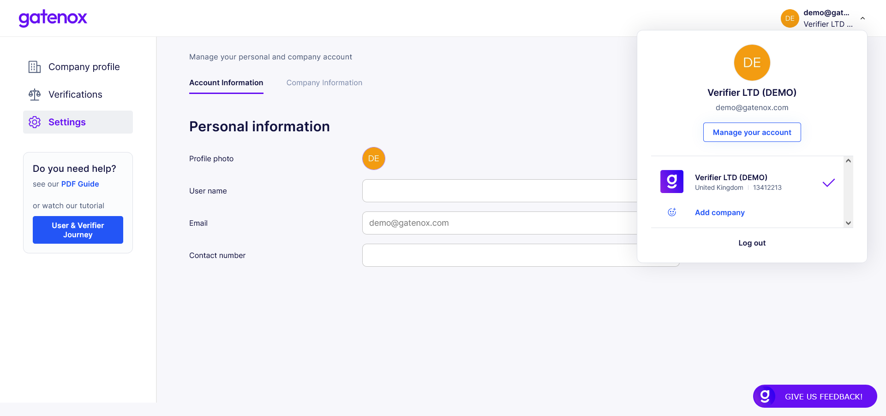

# Configuration and settings

# Settings

Settings can be accessed using the "Settings" tab on the side menu pane on the left or by clicking on the "Manage your account" button in the upper right corner.

<figure><figcaption></figcaption></figure>

The settings tab consist of 2 tabs:

1. **Account information** - to review and (in the future) update personal data
2. **Company information** - to update company profile information like company logo, services description or referral code