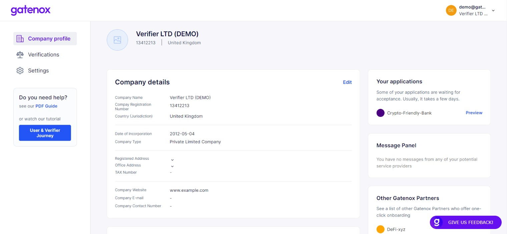
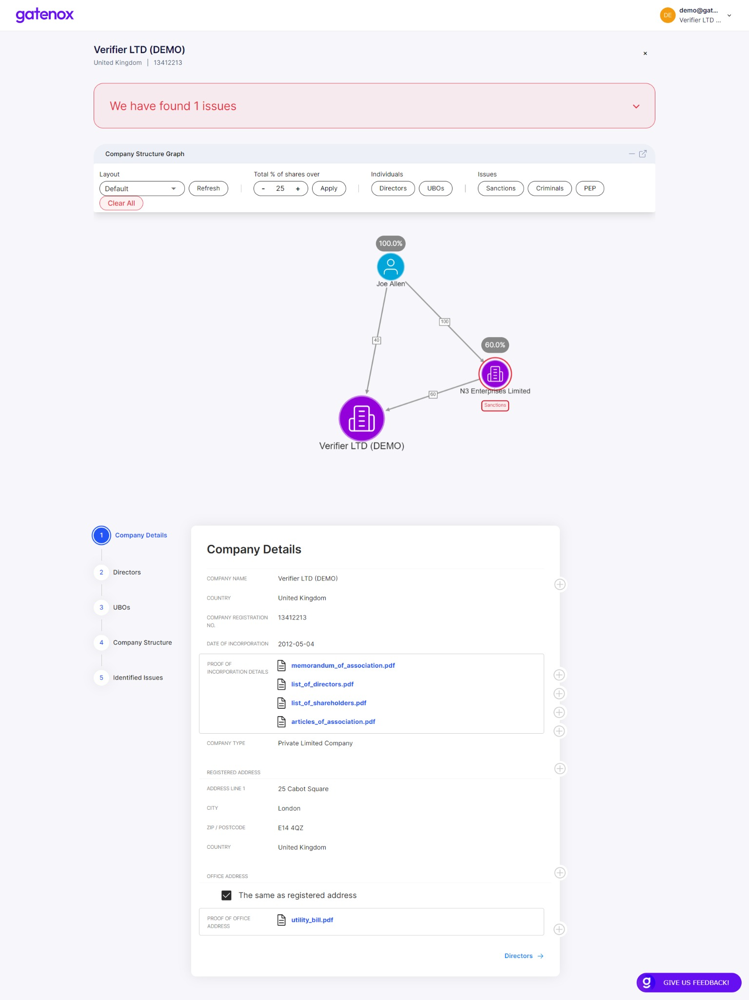

# Your current applications

After sending your profile to the partner, the partner name will be displayed in the box on top of the "Your profile" screen. You can switch between partners by choosing a different one from the list.

<figure><figcaption>
Your applications
</figcaption></figure>

After clicking on each application, you can preview the application data in the same way as the verifier sees them.

<figure><figcaption></figcaption></figure>
