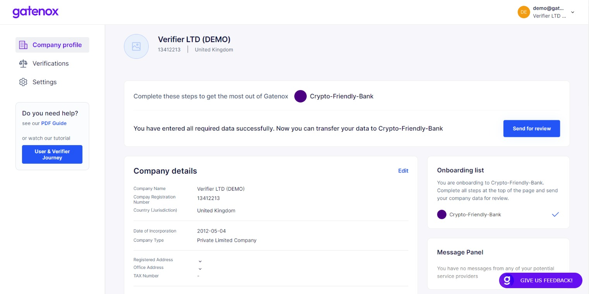
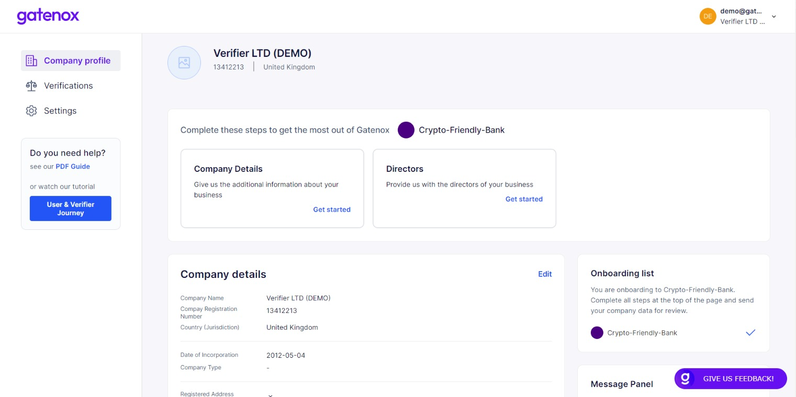

# Share your profile

On the right side of the "your profile" screen, you can find a list of Gatenox partners. To start the onboarding process, click on your chosen partner.

<figure><figcaption></figcaption></figure>

The partner will be added to your current onboarding list. If your profile is completed form the perspective of data required by partner, you will be able to quickly share your profile using the "Send for review" button.

<figure><figcaption></figcaption></figure>

In case additional data is required by partner, a notification will be presented at the top of the screen.

<figure><figcaption></figcaption></figure>

After completing the required informaction, press the "Send for review" button to share your profile with the partner. You will see a list of data which will be sent to the partner.

<figure><figcaption></figcaption></figure>
