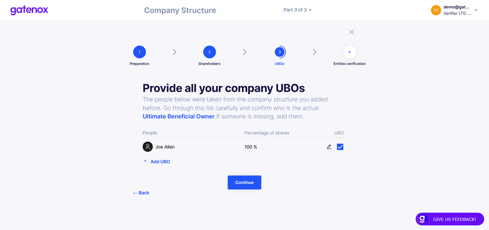
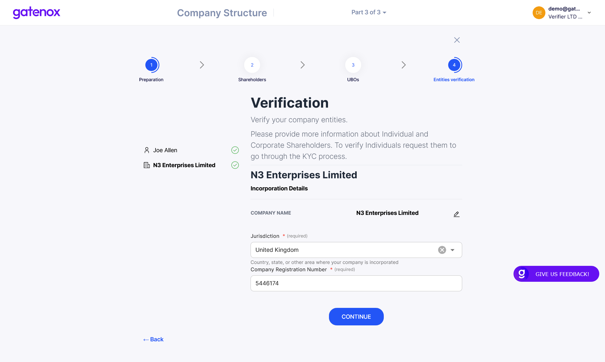
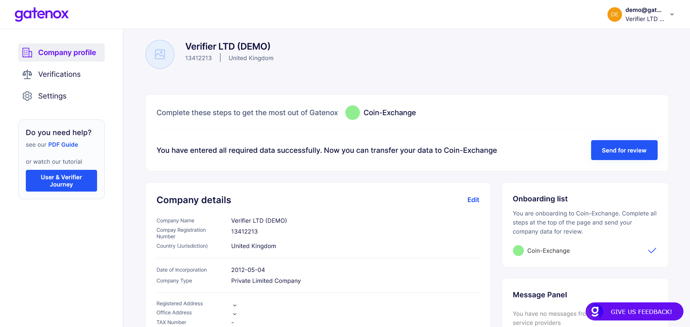
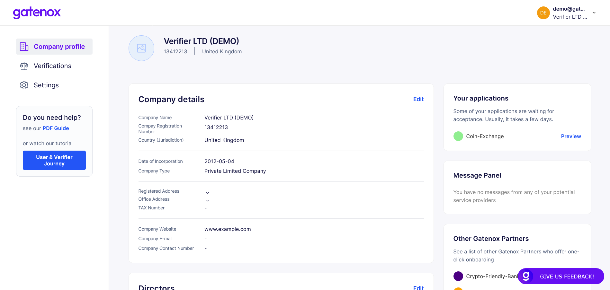

# Company structure

This part is divided into 4 main steps:

1. **Preparation** - displays information about the data and documents that are required
2. **Shareholders** - asks data regarding the structure of your company (you can build any structure by adding Individual and Corporate shareholders)
3. **UBOs** - displays information regarding UBOs (taken from the company structure)
4. **Verification** - asks data regarding Individual and Corporate shareholders

**Preparation**

<figure><figcaption></figcaption></figure>

**Shareholders**

<figure><figcaption></figcaption></figure>

**UBOs - list**

<figure><figcaption></figcaption></figure>

**UBOs - justification**

<figure><figcaption></figcaption></figure>

**Verification** (add detailed data regarding Individual and Corporate shareholders)

<figure><figcaption></figcaption></figure>

Once the required company data is completed, you will be able to send it to the Gatenox Partner by clicking on the _Send for Review_ button.

<figure><figcaption></figcaption></figure>

When your data has been sent, your application will appear in the _Your Applications_ panel on the Company profile screen.

<figure><figcaption></figcaption></figure>
