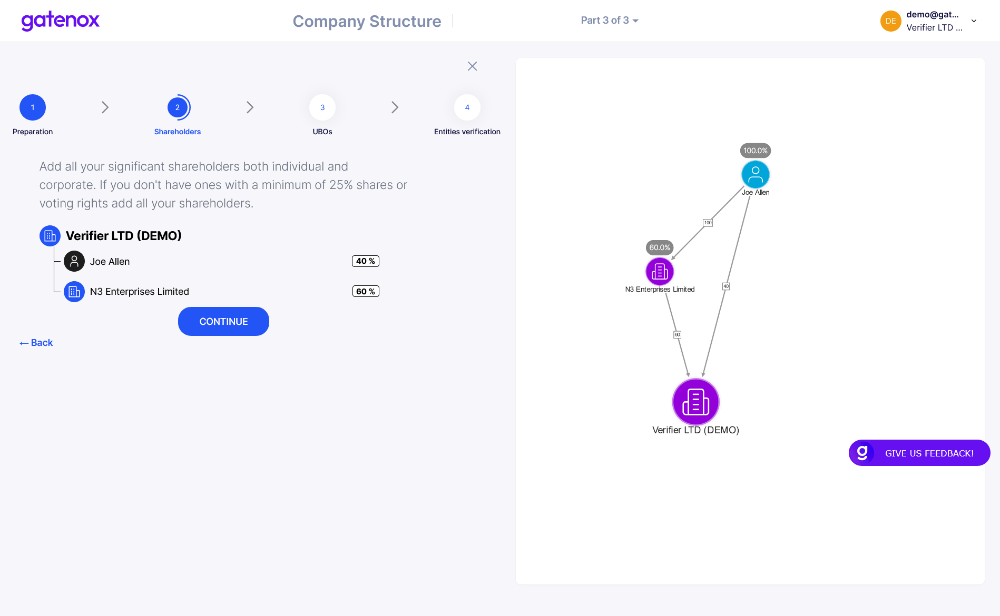

# Company structure

## Introduction

This part is divided into 4 main steps:

1. **Preparation** - displays information about the data and documents that are required
2. **Shareholders** - asks data regarding the structure of your company (you can build any structure by adding Individual and Corporate shareholders)
3. **UBOs** - displays information regarding UBOs (taken from the company structure)
4. **Verification** - asks data regarding Individual and Corporate shareholders

## **Preparation**

<figure><figcaption></figcaption></figure>

## **Shareholders**

<figure><figcaption></figcaption></figure>

## **UBOs**

List

<figure><figcaption></figcaption></figure>

Justification

<figure><figcaption></figcaption></figure>

## **Entities verification**

**Verification** (add detailed data regarding Individual and Corporate shareholders)

<figure><figcaption></figcaption></figure>
