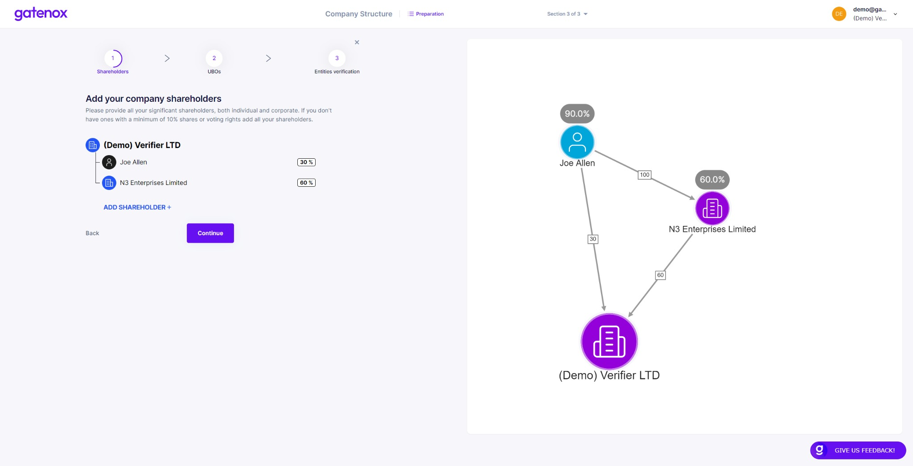
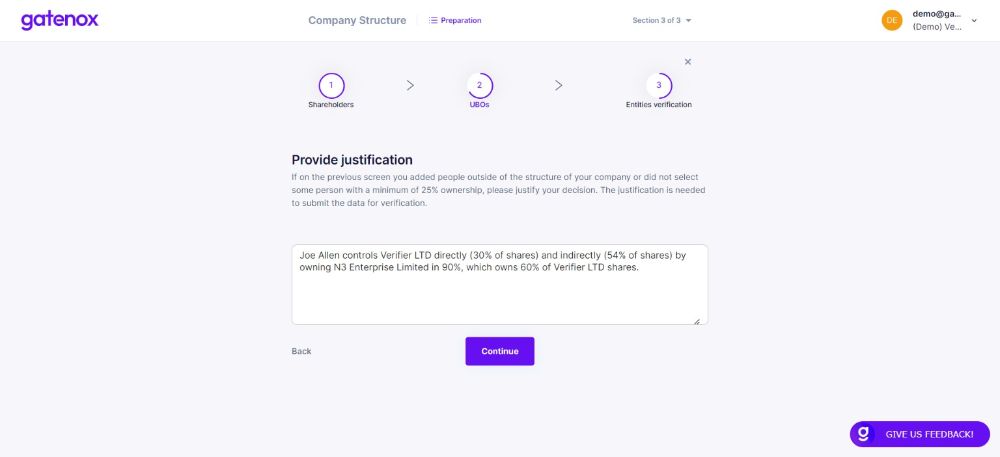

# Company structure

## Introduction

This part is divided into 3 main steps:

1. **Shareholders** - asks data regarding the structure of your company (you can build any structure by adding Individual and Corporate shareholders)
2. **UBOs** - displays information regarding UBOs (taken from the company structure)
3. **Verification** - asks data regarding Individual and Corporate shareholders

## **Shareholders**

<figure><figcaption>
Company structure - shareholders
</figcaption></figure>

## **UBOs**

List

<figure><figcaption>
Company structure - UBOs
</figcaption></figure>

Justification

<figure><figcaption>
Company structure - UBOs justification
</figcaption></figure>

## **Entities verification**

**Verification** (add detailed data regarding Individual and Corporate shareholders)

Individuals

<figure><figcaption>
Company structure - entities verification (individuals)
</figcaption></figure>

Corporates

<figure><figcaption>
Company structure - entities verification (corporates)
</figcaption></figure>
