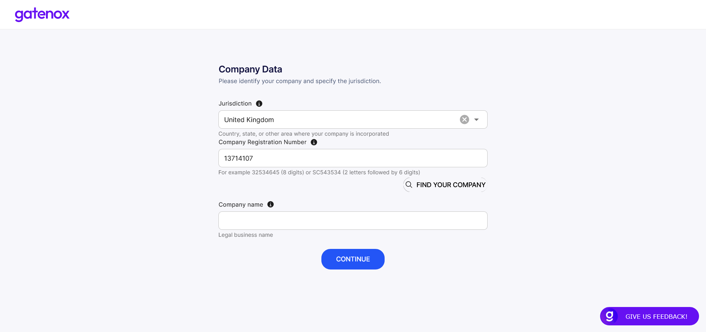

# Create new company

To create a new company profile you need to open the context menu in the upper right corner and click on the “Add company” link.

<figure><figcaption></figcaption></figure>

You will see an “Add new company” screen. In order to facilitate the process of creating a new company profile (entering selected data for you), you must specify exactly what company you mean by entering the jurisdiction and number.

<figure><figcaption></figcaption></figure>

Now you can use the “Find your company” button to search for the name of your company. The result will be displayed in the “Company name” field. If your company is not found, you can enter “Company name” manually and press the “Continue” button. In this case, we will not be able to facilitate the process for you.

<figure><figcaption></figcaption></figure>

Now you can press the “Continue” button to go through the company setup wizard. The “Company details” preparation screen will be displayed.

<figure><figcaption></figcaption></figure>
