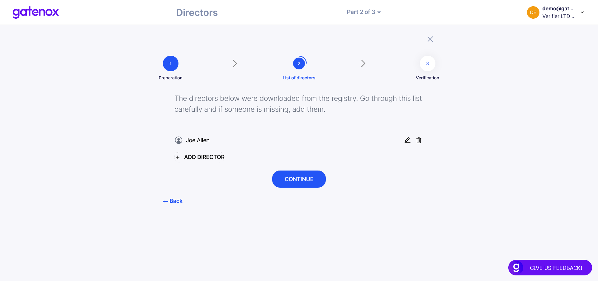
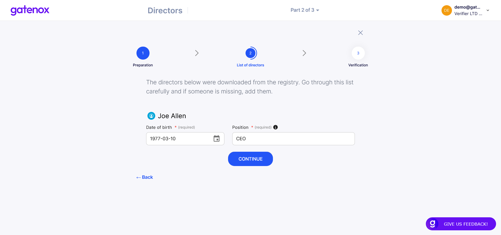
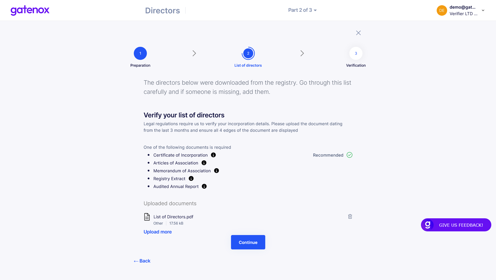
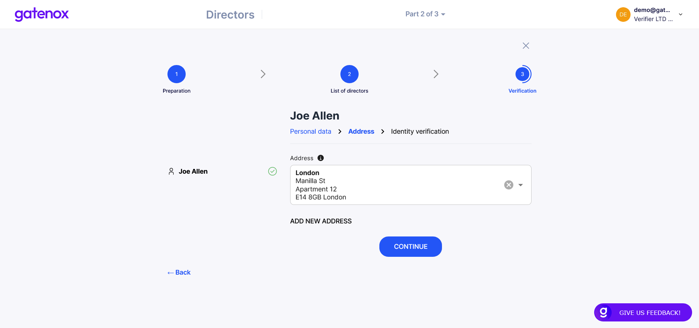

# Directors

## Introduction

This part is divided into 4 main steps:

1. **Preparation** - displays information about the data and documents that are required
2. **List of Directors** - asks data regarding directors’ basic personal information such as date of birth
3. **Verify your list of directors** - provide a document proofing previously entered list of directors
4. **Verification** - asks Know Your Customer (KYC) data for each director

## **Preparation**

<figure><figcaption>
Directors - preparation
</figcaption></figure>

**List of Directors > Add Directors**

<figure><figcaption>
List of directors
</figcaption></figure>

## **List of Directors**

Personal Data

<figure><figcaption>
Directors - personal data
</figcaption></figure>

**List of Directors > Verify your list of directors**

<figure><figcaption>
Directors - verification
</figcaption></figure>

## **Verification**

Personal Data

<figure><figcaption>
Directors - personal data
</figcaption></figure>

**Verification > Address**

<figure><figcaption>
Directors - residential address
</figcaption></figure>

Identity Verification

<figure><figcaption>
Directors - identification document
</figcaption></figure>

<figure><figcaption>
Directors - identification document
</figcaption></figure>
