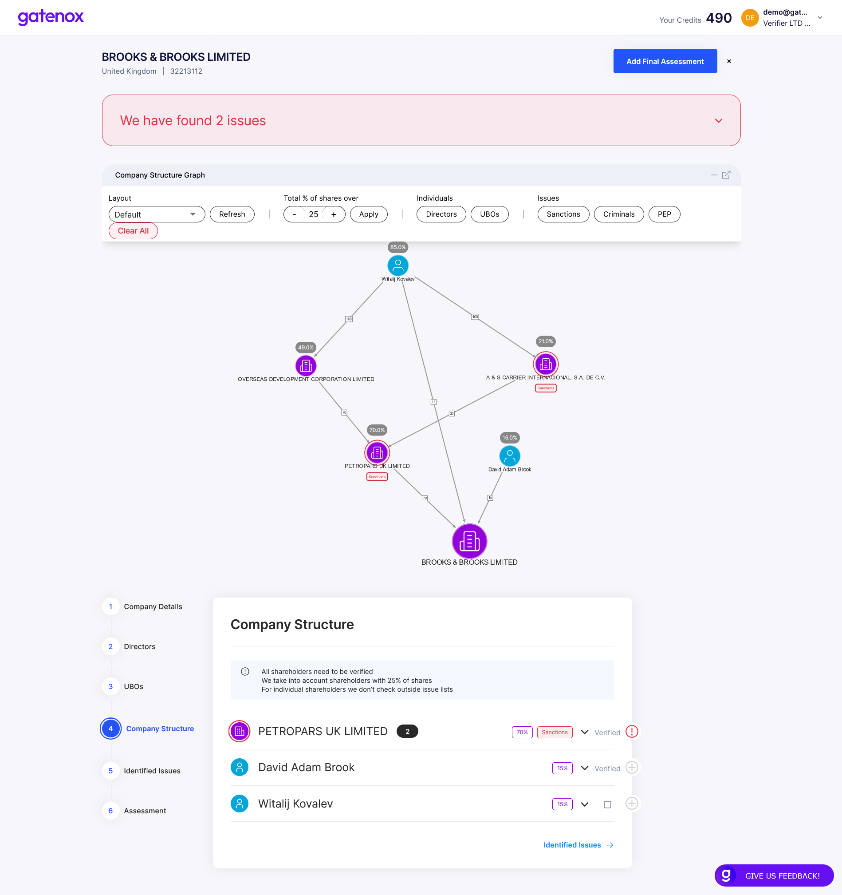

# Extended verification

The basic sanctions check included as a default involves verification of individuals and companies on the internal sanctions list. This currently only includes the OFAC database.

If you need to verify individuals and companies against a myriad of sanction lists, PEP, and criminal watchlists, you can buy additional search credits by selecting an entity on directors, UBOS and company structure tabs. They will be added to the entity's verification basket on the right side of the webpage.

<figure><figcaption></figcaption></figure>

If you have sufficient credits, when you press the “Verify” button, additional verification will be performed and the results will be presented in the same manner as internal checks.

<figure><figcaption></figcaption></figure>