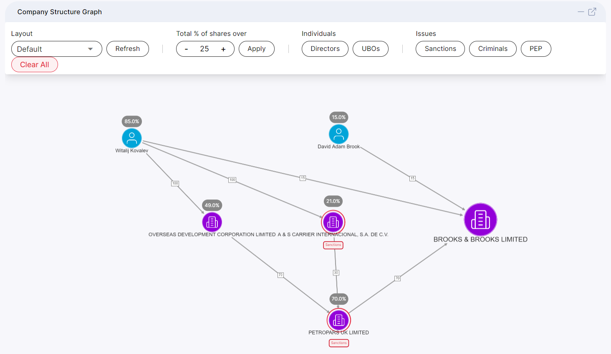
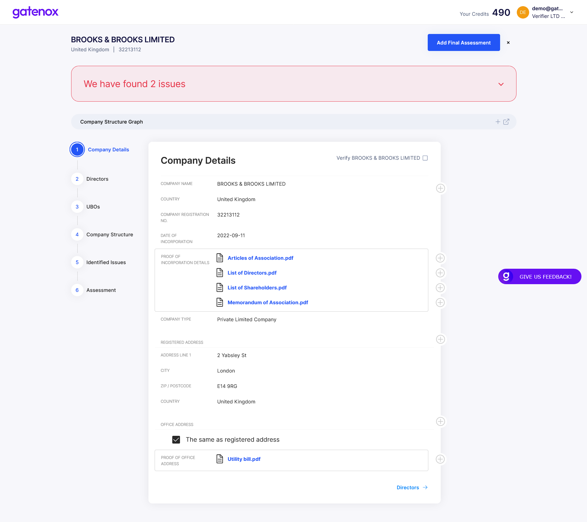
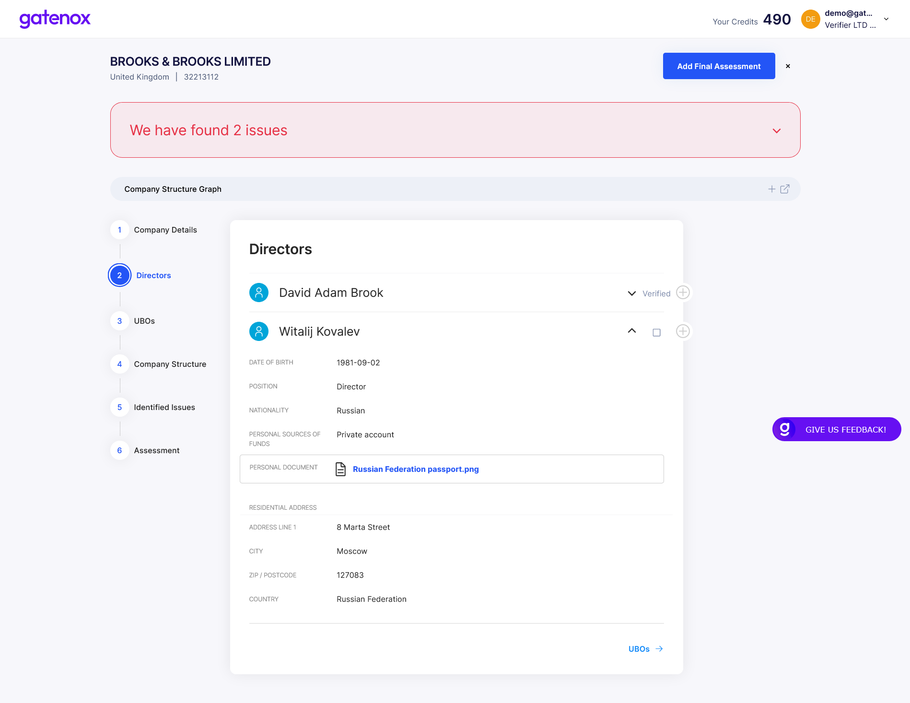
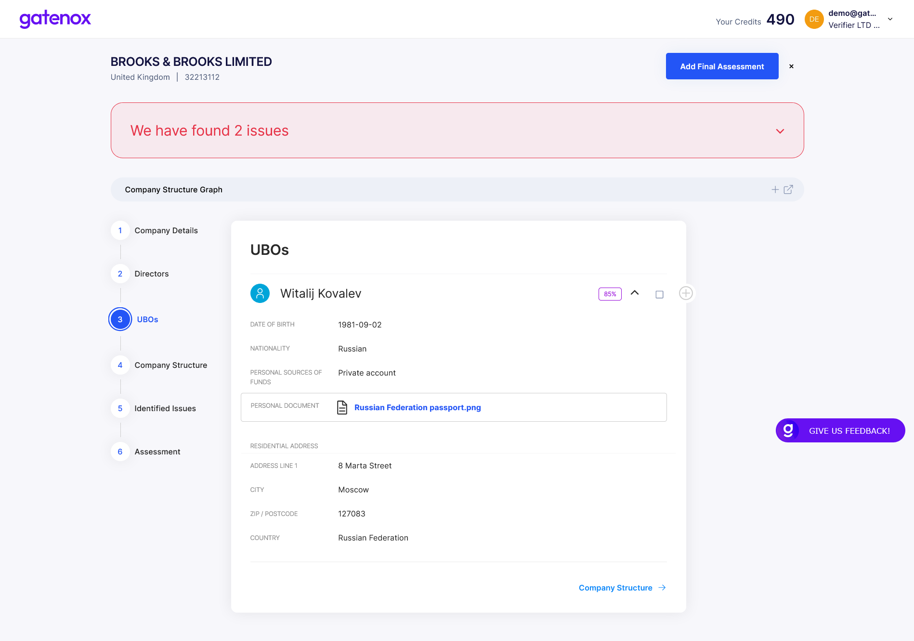
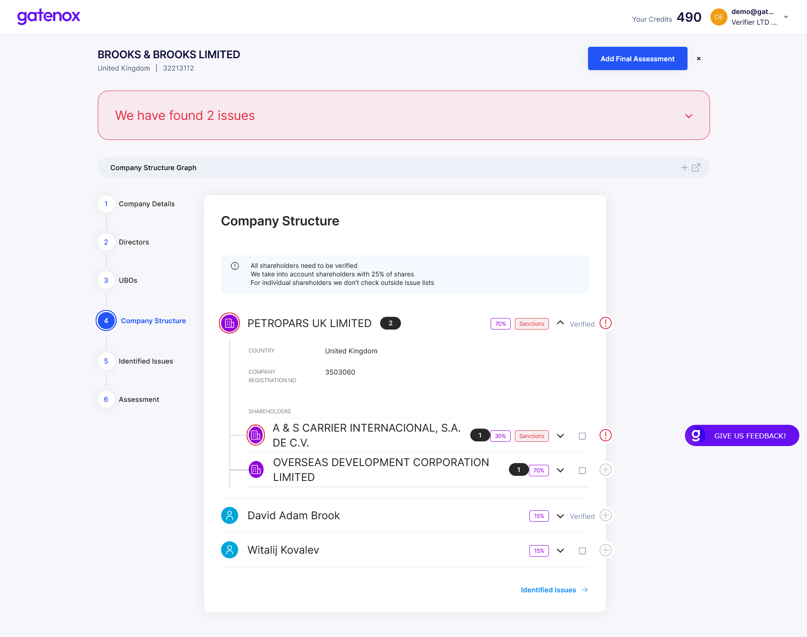
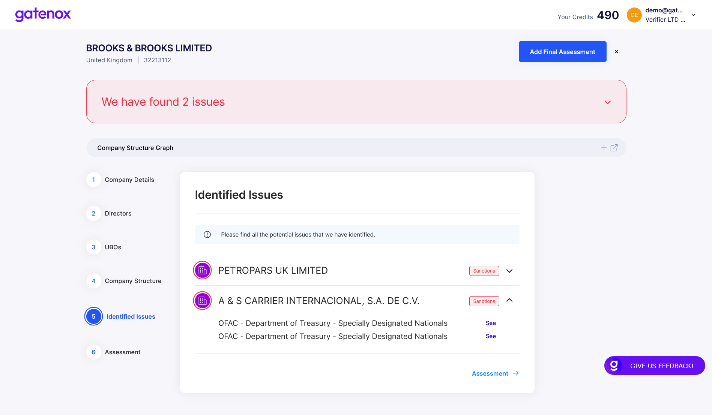
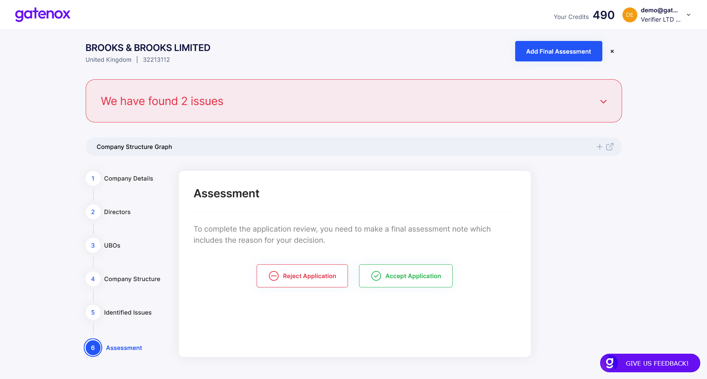

# Review details

## Introduction

Each application is divided into 6 main parts:

* **Company Details** - displays all details related to company incorporation data, addresses, etc.
* **Directors** - displays all details related to company directors (including required KYC information)
* **UBOs** - displays all details related to company UBOs (including required KYC information)
* **Company Structure** - displays all shareholders (this part is connected with the company structure graph that you can see at the top of the review page)
* **Identified Issues** - displays all identified potential issues, e.g. presence of company entities or individuals on sanction, PEP or criminal lists
* **Assessment** - section where you can accept or reject the application and include summary notes

## Review summary

Before the mentioned sections are displayed, a summary of any identified potential issues will appear at the top of the page e.g. presence of company entities or individuals on sanction, PEP or criminal lists in **a red section**.

<figure><figcaption></figcaption></figure>

If no potential issues are found, a green section will be displayed at the top of the page.

<figure><figcaption></figcaption></figure>

In addition, you can view the whole structure of the company in the form of a **fully interactive graph** (it is possible to open the graph in a new browser tab).

<figure><figcaption></figcaption></figure>

## Company details

After having an overview of the company's structure, you can proceed to the process of viewing the data.

**Company Details**

<figure><figcaption></figcaption></figure>

## **Directors**

<figure><figcaption></figcaption></figure>

## **UBOs**

<figure><figcaption></figcaption></figure>

## **Company Structure**

**Company Structure - tree view** (you can view the entire structure by expanding the selection - in this case, clicking the down arrow next to PETROPARS UK LIMITED)

<figure><figcaption></figcaption></figure>

## **Identified issues**

<figure><figcaption></figcaption></figure>

## **Assessment**

<figure><figcaption></figcaption></figure>
