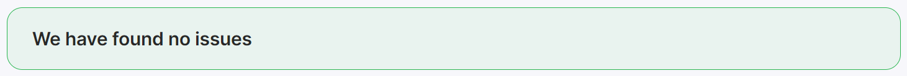
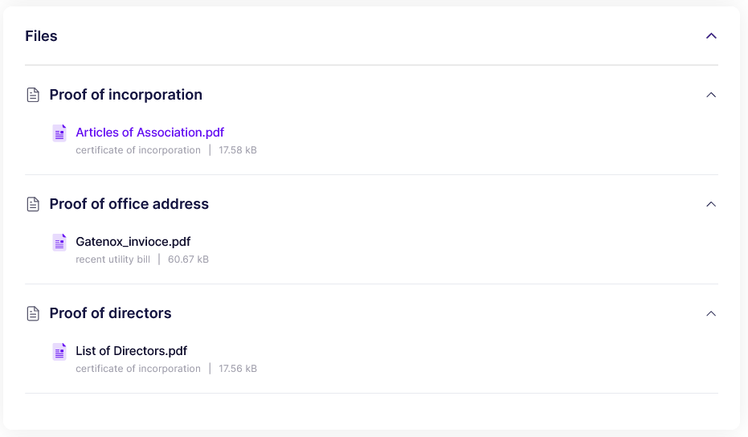

# Review details

## ntroduction

Each application is divided into 8 main parts:

* **Summary** - displays the list of issues related to the application, which has been found by Gatenox Hub. The list may include the result of sanctions check, inconsistency of data or other relevant information regarding review assessment.
* **Company Details** - displays all details related to company incorporation data, addresses, etc.,
* **Business representatives** - displays all details related to company directors (including required KYC information),
* **UBOs** - displays all details related to company UBOs (including required KYC information),
* **Company Structure** - displays all shareholders (this part is connected with the company structure graph that you can see at the top of the review page),
* **Identified Issues** - displays all identified potential issues, e.g. presence of company entities or individuals on sanction, PEP or criminal lists,
* **Files** - displays all company related files attached to the review,
* **Assessment** - section where you can accept or reject the application and include summary notes.

## Review summary

Before the mentioned sections are displayed, a summary of any identified potential issues will appear at the top of the page e.g. presence of company entities or individuals on sanction, PEP or criminal lists in **a red section**.

<figure><figcaption>
Review - found issues
</figcaption></figure>

If no potential issues are found, a green section will be displayed at the top of the page.

<figure><figcaption>
Review - no issues
</figcaption></figure>

## Company details

After having an overview of the company's structure, you can proceed to the process of viewing the data.

<figure><figcaption>
Review - company details
</figcaption></figure>

## **Business representatives**

<figure><figcaption>
Review - business representatives
</figcaption></figure>

## **UBOs**

<figure><figcaption>
Review - UBOs
</figcaption></figure>

## **Company Structure**

**Company Structure - tree view** (you can view the entire structure by expanding the selection - in this case, clicking the down arrow next to PETROPARS UK LIMITED)

<figure><figcaption>
Review - company structure (tree view)
</figcaption></figure>

## **Identified issues**

<figure><figcaption>
Review - identified issues
</figcaption></figure>

## **Files**

<figure><figcaption>
Review - files
</figcaption></figure>

## **Assessment**

<figure><figcaption>
Review - assessment
</figcaption></figure>
