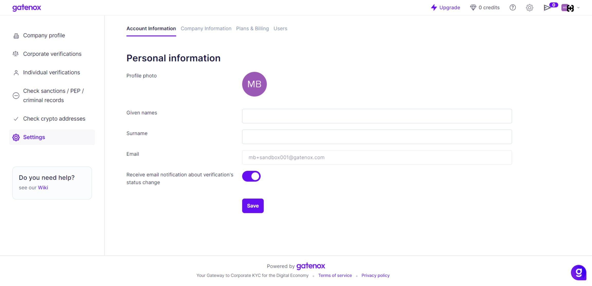

# Account information

This section provides access to your individual account information.

If your account was not set up using Google Login, you have the opportunity to enter your first name and last name.&#x20;

In this tab, you have the option to enable or disable email notifications for case status updates. You can receive notifications in the following cases:

1. As a compliance team, you will receive notification upon new case arrival.
2. As a business user, you will receive notification when:
   1. The compliance team will ask for a data update.
   2. The compliance team will finish the assessment.

<figure><figcaption>
Settings - account information
</figcaption></figure>
