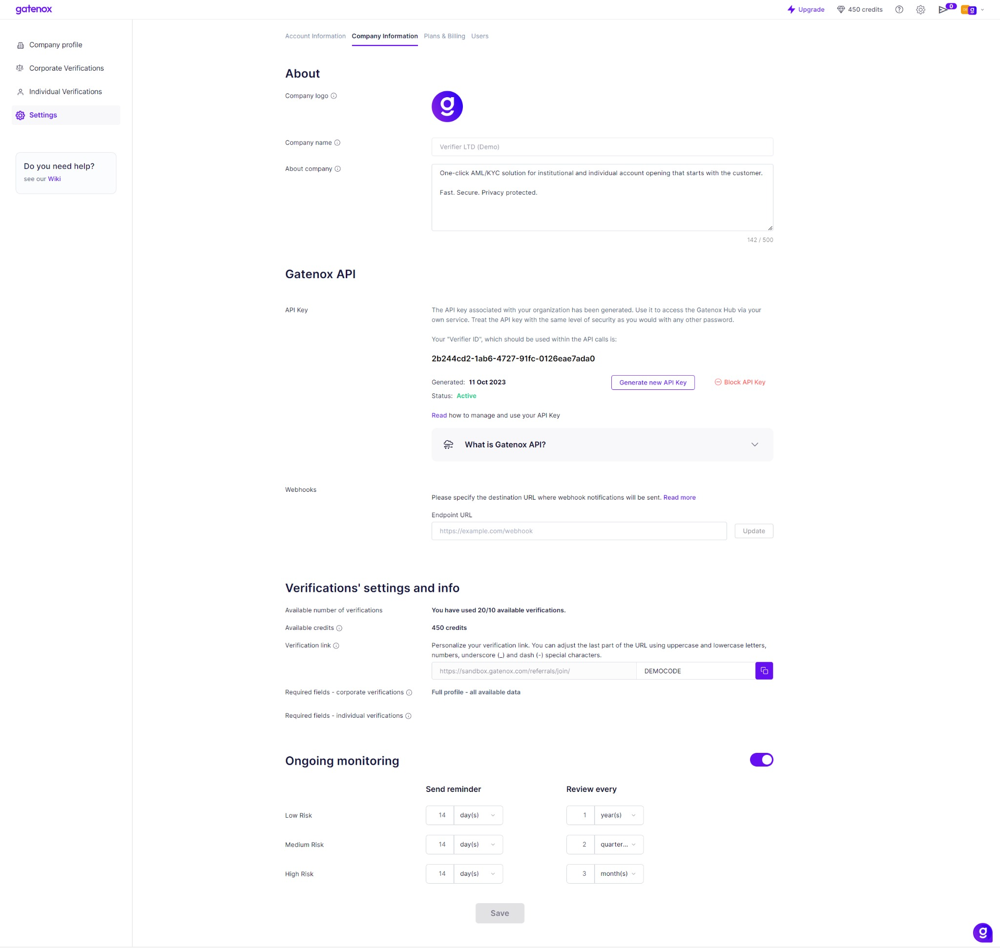

# Company information

The tab is split into 2 sections:

1. **Basics**:
   * you can upload your company logo that is displayed on the Gatenox Hub
   * you can edit the "About Company" details which is a brief description of your company and its services. It is displayed on the welcome screen and will be displayed to users you invite using your referral code
   * you can also check your credit balance. Credits are used to buy additional services such as extended verification on sanctions and PEP lists or to ask users to provide an external KYC verification. To add more credits, please contact our sales department at sales@gatenox.com.
2. **Gatenox API:**
   * you can generate your API key,
   * you can check your verifier ID (used in API calls [api-reference](../gatenox-api/api-reference/ "mention")),&#x20;
   * you can check the details of the generated API key,
   * you can block your API Key,
   * you can enter the webhook endpoint to receive notifications.&#x20;
3. **Verification**:
   * you can see the required fields which are mandatory for every user you verify. This data can be configured in the setup phase.
   * you can customize your verification link.

<figure><figcaption>
Settings - Company information
</figcaption></figure>


Attention! Once you have generated the API key, its value will be displayed. Please copy and save it - you will not be able to show it again.


<figure><figcaption>
API key
</figcaption></figure>
