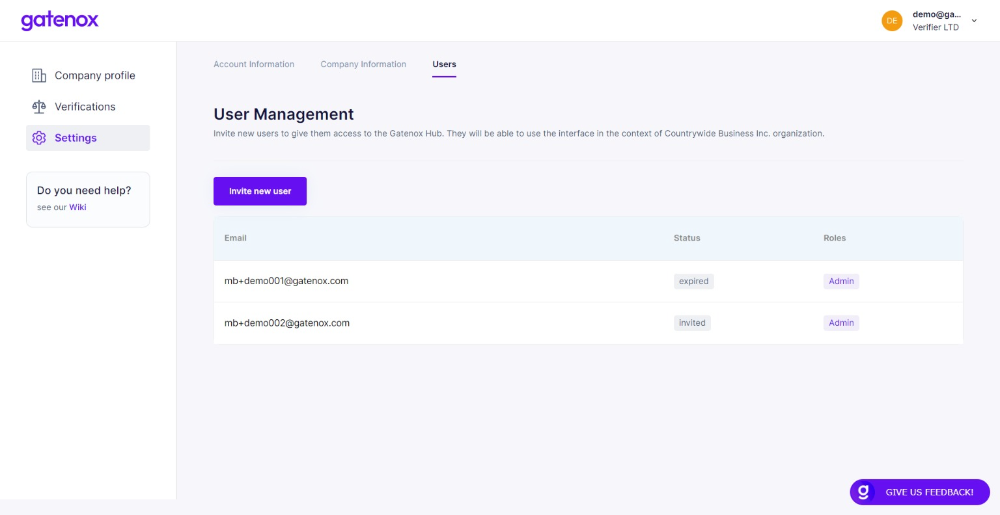

# Users management

On "the "Users" tab in the "Settings" menu, you can manage your team members.

To add a new user to you corporate profile click on the "Invite new user" button.&#x20;

<figure><figcaption>
Setting - Users management
</figcaption></figure>

The popup window will be displayed. Now you can, you can enter user corporate email address and add a short message, which will be send with the invitation email.

<figure><figcaption>
Invite users
</figcaption></figure>

The list of invited people with the invitation status will be refreshed.

<figure><figcaption>
Settings - Users management
</figcaption></figure>
