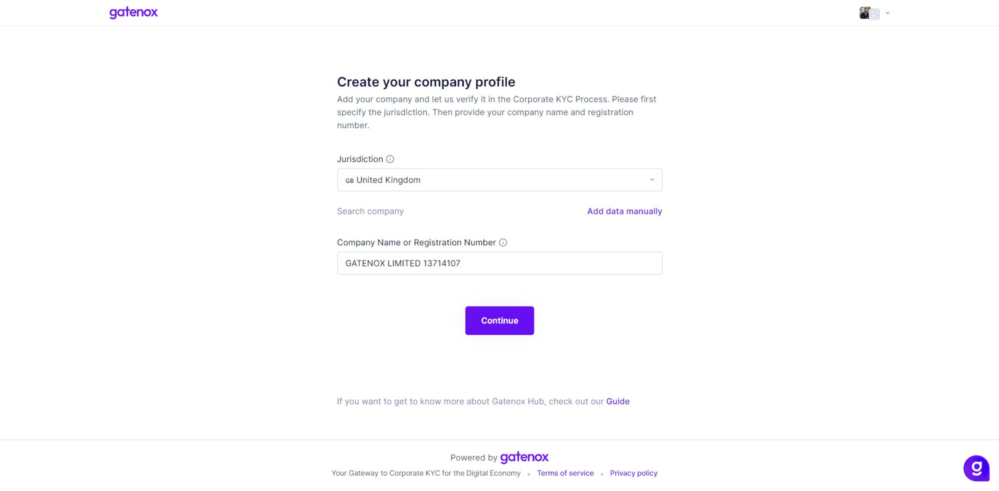

# Add new company

To create a new company profile you need to open the context menu in the upper right corner and click on the “Add company” link.

<figure><figcaption>
Contexts menu
</figcaption></figure>

You will see the “Add new company” screen. In order to facilitate the process of creating a new company profile (entering selected data for you), you must enter the jurisdiction and company registration number.

First, enter your company's jurisdiction. Then you have options to search for your company using:

* name - please provide at least 3 chars to start the search process,
* number - please provide the exact company number.

After entering the search phrase, you will see a list of companies meeting the criteria set in the query

<figure><figcaption>
Add new company
</figcaption></figure>

If your company is not found, you can enter “Company name” manually and press the “Continue” button. In this case, you will have to enter all the data manually.

<figure><figcaption>
Find your company - add company manually
</figcaption></figure>

Now you can press the “Continue” button to go through the company setup wizard. The “Business details” screen will be displayed.

<figure><figcaption>
Business details
</figcaption></figure>
