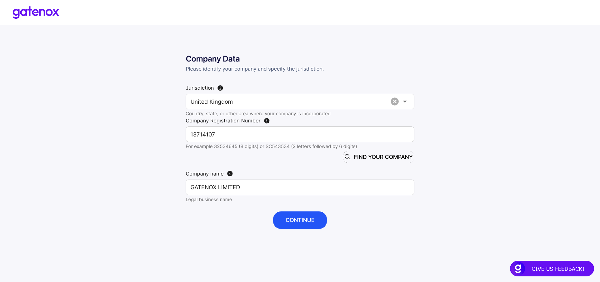

# Add new company

To create a new company profile you need to open the context menu in the upper right corner and click on the “Add company” link.

<figure><figcaption>
Contexts menu
</figcaption></figure>

You will see the “Add new company” screen. In order to facilitate the process of creating a new company profile (entering selected data for you), you must enter the jurisdiction and company registration number.

<figure><figcaption>
Add new company
</figcaption></figure>

First, enter your company's jurisdiction and registration number. Now you can use the “Find your company” button to search for the name of your company.

<figure><figcaption>
Find your company
</figcaption></figure>

The result will be displayed in the “Company name” field. If your company is not found, you can enter “Company name” manually and press the “Continue” button. In this case, you will have to enter all the data manually.

<figure><figcaption>
Find your company - check results
</figcaption></figure>

Now you can press the “Continue” button to go through the company setup wizard. The “Company details” basic data screen will be displayed.

<figure><figcaption>
Company details - preparation
</figcaption></figure>
