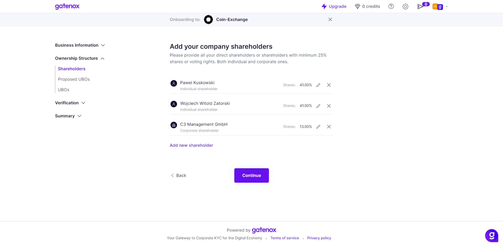
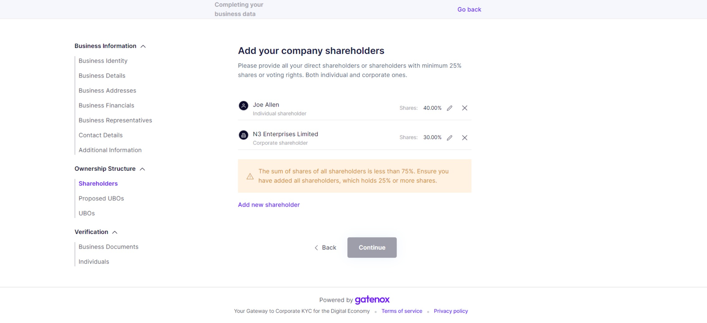

# Shareholders

The "Shareholders" screen allows users to manage the shareholders of their company.

It's important to keep accurate and up-to-date information for shareholders, as this information may be necessary for compliance, communication, or legal purposes. Additionally, understanding the ownership and control of the company is essential for making business decisions and managing company affairs.

The screen also includes a list of already added shareholders. Users can add new shareholders by selecting the "Add new shareholder" button and entering the required information in the relevant fields. Alternatively, users can choose to add a shareholder from a previously prepared list by selecting the "Select from the list" option.

If you select "Individual", you will be asked to provide the shareholder's given name, surname, and percentage of shares. If you select "Company", you will need to provide the jurisdiction, company name, and company registration number.

It's important to note that the percentage of shares listed for each shareholder should add up to 100% for all shareholders combined.

You can also edit a previously added shareholder by clicking on the "pencil" icon next to their name in the list of shareholders. This will bring up their details and allow you to make changes as needed. Remember to save your changes before exiting the screen.

#### Fields


The fields listed in the documentation may differ from those displayed in your profile. The specific fields required by the company you are onboarding with depend on their specific data needs.


Here is a brief description of each field:

1. Individual / Company - radio button: This field allows users to select whether the shareholder is an individual or a company. Depending on the selection, additional fields may be displayed.

For individual shareholders:

1. Given names: This field allows users to enter the given names of the shareholders. This may be useful for identifying the shareholder in communication or legal documents.
2. Surname: This field allows users to enter the surname of the shareholder. This may be useful for identifying the shareholder in communication or legal documents.
3. Percentage of shares: This field allows users to enter the percentage of shares held by the shareholder. This information is important for determining ownership and control of the company.

For corporate shareholders:

1. Jurisdiction: This field allows users to select the legal jurisdiction in which their company is registered. This could be a country, state, or province, depending on the user's location.
2. Company name: This field is where users can enter the official name of their company. This should be the name that appears on official documents and legal filings.
3. Company Registration Number: This field allows users to enter the unique registration number assigned to their company by the relevant government agency. This number is used to identify the company and may be required for certain types of transactions or filings.

<figure><figcaption>
Shareholders
</figcaption></figure>


The message will be presented if you provide less than 75% of shareholders.


<figure><figcaption>
Notification if the lists involves less than 75% of shareholders
</figcaption></figure>

#### Documents

In some cases, a business may be required to provide proof of the list of shareholders, such as when registering with a government agency, cryptocurrency exchange, or opening a bank account. Users can upload proof of the list of shareholders on the [business-documents.md](../verification/business-documents.md "mention") tab, which is used to store important business documents. Users can upload digital copies of these documents for safekeeping and to provide to relevant parties upon request.
