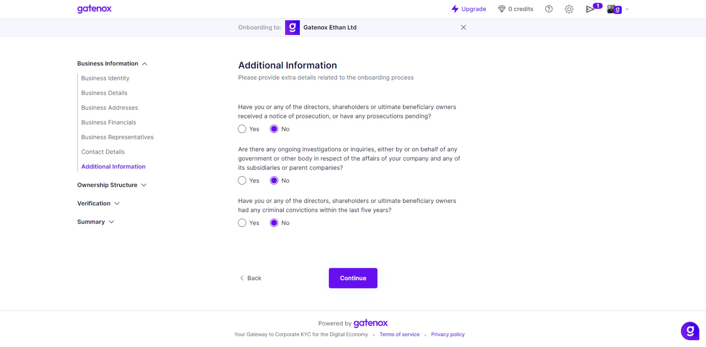

# Additional information

The "Additional Information" screen is where users can provide additional details required during the onboarding process.

#### Fields


The fields listed in the documentation may differ from those displayed in your profile. The specific fields required by the company you are onboarding with depend on their specific data needs.


Here is a brief description of the fields:

1. Notice of Prosecution: Users are asked to indicate whether they or any of the directors, shareholders, or ultimate beneficiary owners have received a notice of prosecution or have any prosecutions pending. This helps gather information regarding any ongoing legal proceedings.
2. Ongoing Investigations or Inquiries: Users are asked to disclose if there are any ongoing investigations or inquiries, either conducted by or on behalf of any government or other body, regarding the affairs of their company, subsidiaries, or parent companies. This helps assess any potential legal or regulatory issues.
3. Criminal Convictions: Users are required to disclose whether they or any of the directors, shareholders, or ultimate beneficiary owners have had any criminal convictions within the last five years. This information is crucial for assessing the integrity and compliance of the individuals involved.
4. License Required: Users are prompted to specify whether a license is required to conduct their business operations. If applicable, they need to provide the license details in the subsequent fields.
5. License Number: Users should enter the unique identification number associated with the required license.
6. License Authority Name: Users should provide the name of the authority or regulatory body that issued the license.
7. License Dates: Users should enter the date of issue and the date of expiry of the license.

<figure><figcaption>
Additional information
</figcaption></figure>
