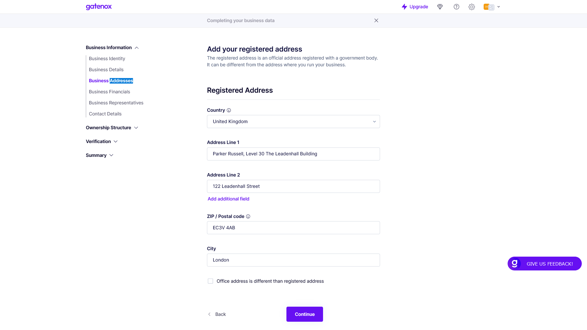

# Business Addresses

The "Business Addresses" screen is where users can enter and manage the various addresses associated with their company.

On this screen, users can update their company's address information as needed. They may need to make changes if they move to a new location or if they need to update their registered address with the government agency. Keeping this information up-to-date is important for legal and regulatory compliance, as well as for ensuring that customers and partners can easily find and contact the company.

#### Fields


The fields listed in documentation may differ from those displayed in your profile. The specific fields required by the company you are onboarding with depend on their specific data needs.


Here is a brief description of each field:

1. Registered Address: This field allows users to enter the official address of their company as registered with the relevant government agency.
2. Country: This field allows users to select the country in which their company is located.
3. Address Line 1: This field is where users can enter the first line of their business address, typically including the street number and name.
4. Address Line 2 and Address Line 3: These fields allow users to provide additional information about their business address, such as a suite or unit number.
5. Add additional field: This field allows users to add any additional information related to their business address that may be relevant, such as a building name or landmark.
6. ZIP / Postal code: This field allows users to enter the ZIP or postal code associated with their business address.
7. City: This field allows users to enter the city in which their business is located.
8. Office address is different than registered address: This checkbox allows users to indicate whether their office address is different from their registered address.

<figure><figcaption>
Business Addresses
</figcaption></figure>

#### Proof of company's address

In some cases, a business may be required to provide proof of their address, such as when registering with a government agency, crypto crypto currency exchange or opening a bank account. Users can upload proof of their business address on the [business-documents.md](../verification/business-documents.md "mention") tab, which is used to store important business documents. Users can upload digital copies of these documents for safekeeping and to provide to relevant parties upon request.

###
