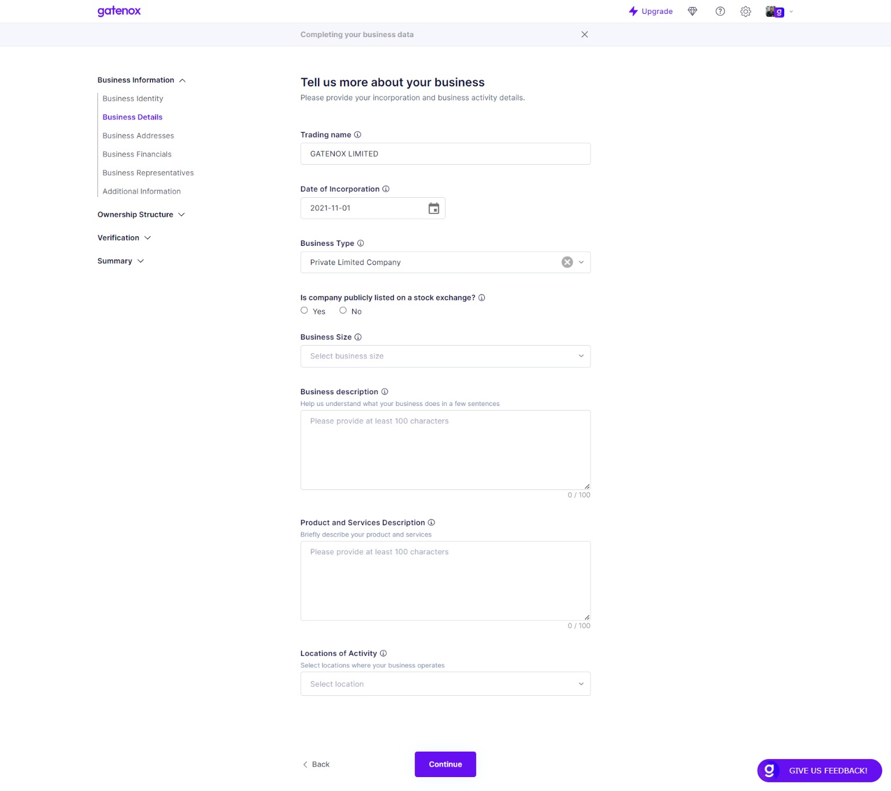

# Business Details

The "Business Details" screen is where users can enter and manage various information about their company.

On this screen, users can update their company's information as needed. They may need to make changes if their business type or size changes, or if they expand into new locations. Keeping this information up-to-date is important for regulatory compliance, marketing efforts, and business development.

#### Fields


The fields listed in documentation may differ from those displayed in your profile. The specific fields required by the company you are onboarding with depend on their specific data needs.


Here is a brief description of each field:

1. Trading name: This field allows users to enter the name under which their company conducts its business. It may be different from the legal name of the company.
2. Date of Incorporation: This field allows users to enter the date on which their company was officially incorporated. This is important for legal and regulatory compliance.
3. Business Type: This field allows users to specify the type of business their company engages in. This could include manufacturing, retail, service, or other types of businesses.
4. Public company listed on stock exchange - this filed indicates, if company is listed on stock exchange.
5. Business Size: This field allows users to indicate the size of their company in terms of the number of employees, annual revenue, or other relevant metrics.
6. Business description: This field allows users to provide a brief overview of their company, including its history, mission, and values.
7. Product and Services Description: This field allows users to describe the products or services that their company offers. This could include information about pricing, features, and benefits.
8. Locations of Activity: This field allows users to specify the geographical locations where their company operates. This could include specific cities, regions, or countries.

<figure><figcaption>
Business Details
</figcaption></figure>

#### Proof of incorporation details

In some cases, a business may be required to provide proof of company details, such as when registering with a government agency, crypto crypto currency exchange or opening a bank account. Users can upload proof of the company details on the [business-documents.md](../verification/business-documents.md "mention") tab, which is used to store important business documents. Users can upload digital copies of these documents for safekeeping and to provide to relevant parties upon request.

