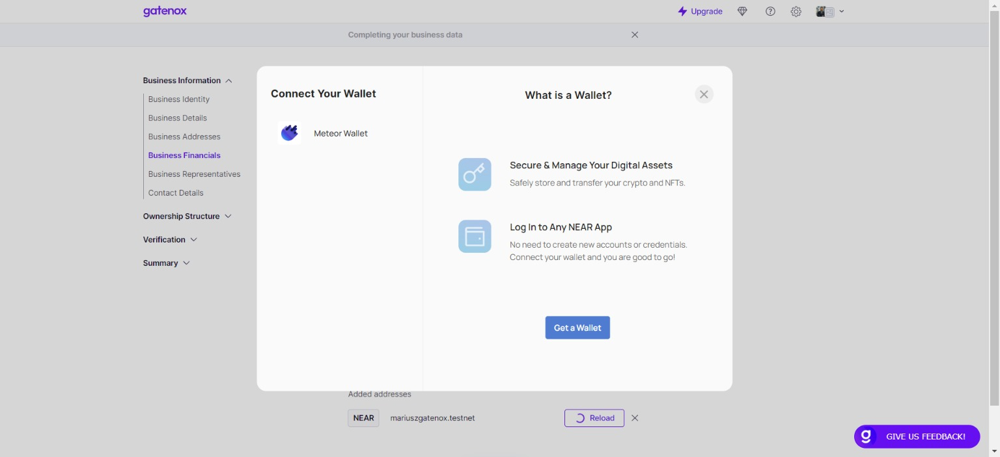
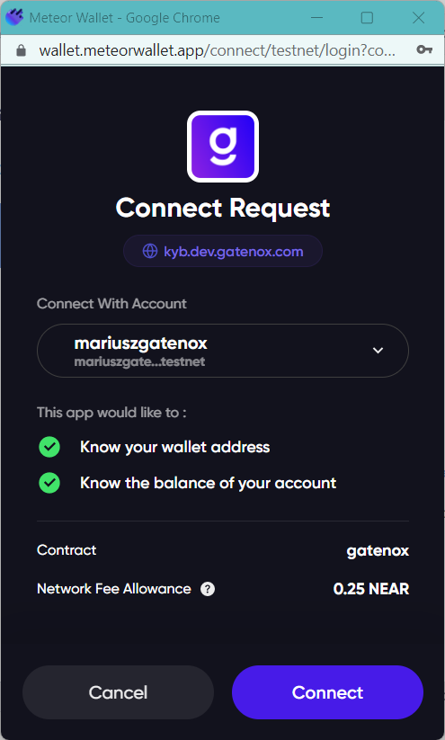
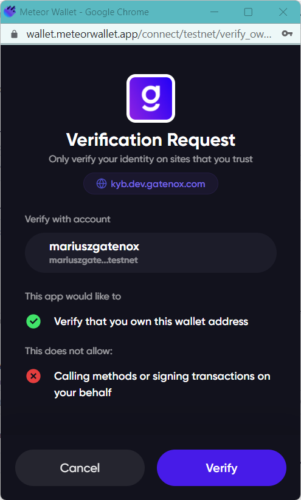
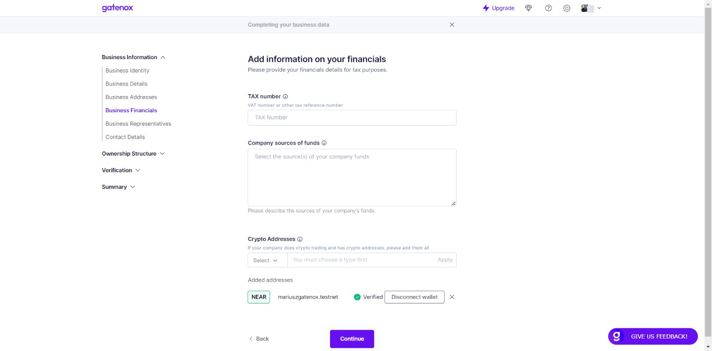

# Business Financials

The "Business Financials" screen is where users can enter and manage various financial information related to their company.

On this screen, users can update their company's financial information as needed. They may need to make changes if their sources of funding change, or if they start accepting cryptocurrency payments. Keeping this information up-to-date is important for tax reporting purposes and for maintaining accurate financial records. It's important to note that the information entered on this screen is typically sensitive and should be kept confidential.

#### Fields


The fields listed in documentation may differ from those displayed in your profile. The specific fields required by the company you are onboarding with depend on their specific data needs.


Here is a brief description of each field:

1. TAX number: This field allows users to enter their company's tax identification number, which is typically assigned by the government.
2. Company sources of funds: This field allows users to specify the various sources of funding for their company, such as investments, loans, or revenue from sales.
3. Crypto Addresses: This field allows users to enter any cryptocurrency addresses associated with their company. This may include addresses for Bitcoin, Ethereum, or other digital currencies.

<figure><figcaption>
Business Financials
</figcaption></figure>

#### Crypto currency address verification

In addition to entering crypto addresses on the "Business Financials" screen, users can also verify ownership of crypto currency addresses for NEAR blockchain ([https://near.org](https://near.org)) by connecting wallet and signing a message.

<figure><figcaption>
NEAR - add and check NEAR address
</figcaption></figure>

For NEAR crypto addresses, before adding a crypto address to the list, we verify if the address exists on the NEAR blockchain. This is important to ensure that the address is valid and can be used for transactions. To perform the verification, we use the NEAR blockchain explorer to check if the address has any associated transactions or balance.

If the address is found on the blockchain, users can proceed to add it to their financial records. If the address is not found, users will receive an error message and will not be able to proceed with adding it. This verification step helps to ensure the accuracy and reliability of the financial records stored on our platform.

Currently, we support the "Meteor" wallet for this process ([https://meteorwallet.app/](https://meteorwallet.app/)). However, we plan to support more wallets as their owners implement the "verifyOwner" method from NEAR (more information on the "verifyOwner" method can be found here: [https://docs.near.org/tools/wallet-selector#verify-owner](https://docs.near.org/tools/wallet-selector#verify-owner)).

<figure><figcaption>
NEAR - choose wallet using Wallet Selector
</figcaption></figure>

To verify ownership using the "Meteor" wallet, users can follow the instructions provided by the wallet provider.

The process involves connecting their wallet to the NEAR blockchain and signing a message that confirms ownership of the address.

<figure><figcaption>
NEAR - the wallet is connected
</figcaption></figure>

Then the signed message is verified in Gatenox Hub. By doing so, users can provide proof that they are the rightful owners of the address, which may be useful for various purposes such as investment reporting or auditing.

It's important to note that the exact steps for verifying ownership may vary depending on the specific wallet and blockchain being used.

<figure><figcaption>
NEAR - the address is verified
</figcaption></figure>

Users should always follow the instructions provided by their wallet and blockchain providers to ensure a secure and accurate verification process.
