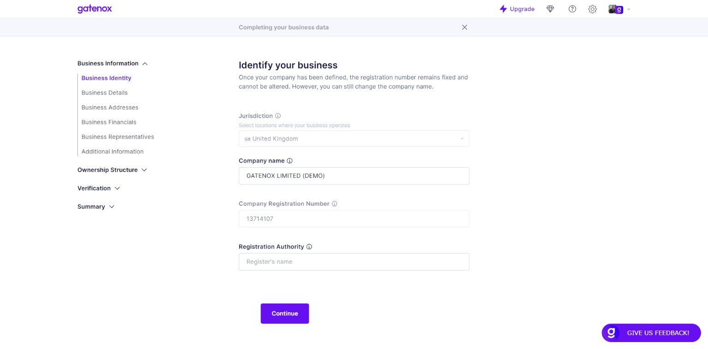

# Business Identity

The "Business Identity" screen is where users can enter and manage their company's basic information.

On this screen, users can update their company's information as needed. They may need to make changes if their company's name or registration number has changed, or if they move to a new jurisdiction. Keeping this information up-to-date is important for legal and regulatory compliance, as well as for building trust with customers and partners.


The fields listed in documentation may differ from those displayed in your profile. The specific fields required by the company you are onboarding with depend on their specific data needs.


Here is a brief description of each field:

1. Jurisdiction: This field allows users to select the legal jurisdiction in which their company is registered. This could be a country, state, or province, depending on the user's location.
2. Company name: This field is where users can enter the official name of their company. This should be the name that appears on official documents and legal filings.
3. Company Registration Number: This field allows users to enter the unique registration number assigned to their company by the relevant government agency. This number is used to identify the company and may be required for certain types of transactions or filings.
4. Registration Authority - This field refers to the specific organization or governmental body responsible for overseeing the registration and regulation of companies within a particular jurisdiction. It is the entity that maintains the official records of registered companies and ensures compliance with legal requirements. The Registration Authority's name provided in this field indicates the specific authority that has jurisdiction over the company being referenced.

<figure><figcaption>
Business Identity
</figcaption></figure>

In some cases, a business may be required to provide proof of company's identification data, such as when registering with a government agency, crypto crypto currency exchange or opening a bank account. Users can upload proof  of company's identification data on the [business-documents.md](../verification/business-documents.md "mention") tab, which is used to store important business documents. Users can upload digital copies of these documents for safekeeping and to provide to relevant parties upon request.
