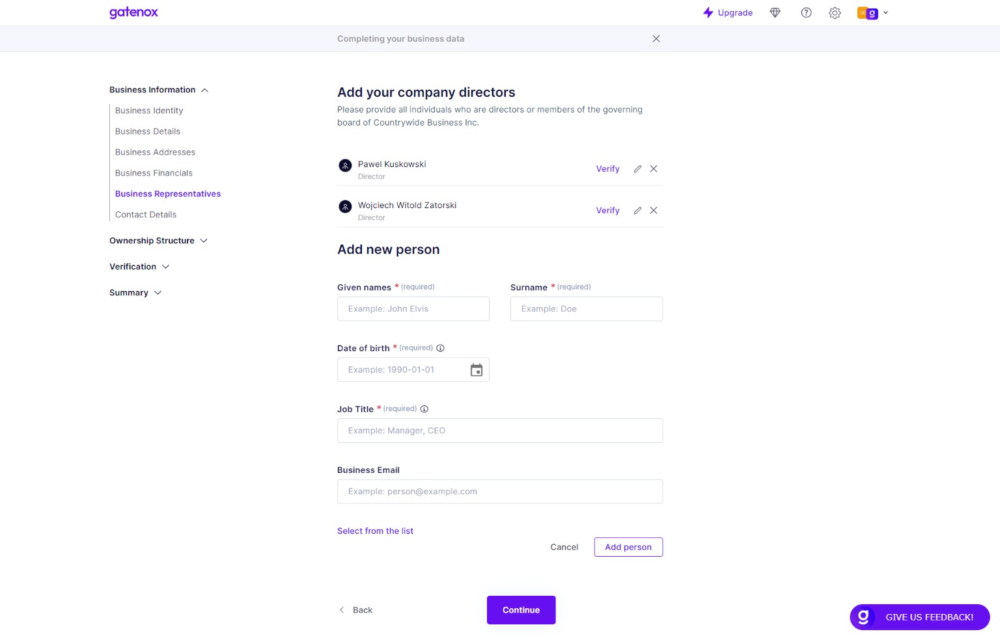

# Business Representatives

Managing representatives on this screen is important for keeping accurate records of who is authorized to act on behalf of the company. This information may be required for legal and regulatory compliance purposes, as well as for internal reporting and decision-making. It's important to ensure that the details entered for each representative are accurate and up-to-date.

The "Business Representatives" screen allows users to manage the representatives of their company.

Users can add new representatives by entering their details in the fields provided. Alternatively, they can choose a representative from a previously prepared list. Once a representative has been added, they will be displayed in a list on the same screen. From this list, users can view and edit the details of each representative, or remove them if necessary.

#### Fields


The fields listed in documentation may differ from those displayed in your profile. The specific fields required by the company you are onboarding with depend on their specific data needs.


Here is a brief description of fields:

1. Given names: This field allows users to enter the given names of the representative.
2. Surname: This field allows users to enter the surname of the representative.
3. Date of birth: This field allows users to enter the date of birth of the representative.
4. Job Title: This field allows users to enter the job title of the representative.
5. Business Email: This field allows users to enter the email address of the representative.

<figure><figcaption>
Business Representatives
</figcaption></figure>

In addition to adding new representatives and managing their details, users can also edit previously added representatives on the "Business Representatives" screen. If a representative's details change, such as their job title or email address, users can easily update the information in the relevant fields.

#### KYC procedure


Learn more about verification of people on [individuals.md](../verification/individuals.md "mention") page.


In some cases, users may need to verify the identity of their representatives for legal or regulatory compliance purposes. To do so, users can choose from several options on the "Business Representatives" screen:

1. Complete data manually: Users can manually enter the representative's personal information, such as their date of birth and job title, to help verify their identity.
2. Invite to KYC process: Users can invite the representative to complete a Know Your Customer (KYC) process, where they will be asked to provide additional information and documentation to verify their identity.
3. Perform full KYC procedure with IDV and face-matching and liveness check: Users can invite the representative to undergo a full KYC procedure, which may involve identity verification (IDV) checks, face matching, and liveness checks to confirm their identity.

By verifying the identity of their representatives, users can help ensure that their company is complying with relevant laws and regulations, as well as maintaining a high level of security and trust with their business partners.

#### Proof: list of directors / representatives

In some cases, a business may be required to provide proof of list of directors / representatives, such as when registering with a government agency, crypto crypto currency exchange or opening a bank account. Users can upload proof of their business address on the [business-documents.md](../verification/business-documents.md "mention") tab, which is used to store important business documents. Users can upload digital copies of these documents for safekeeping and to provide to relevant parties upon request.
