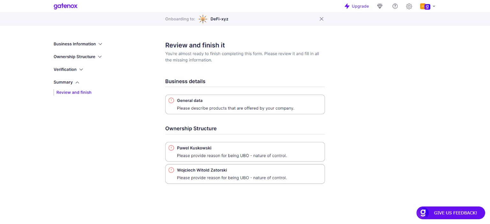
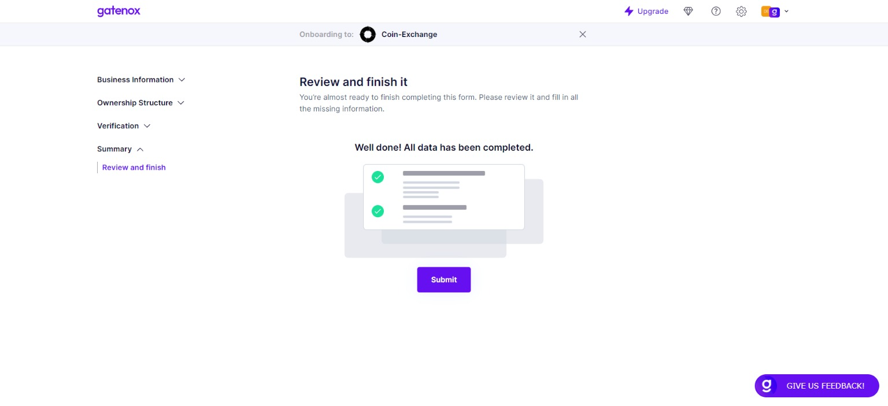

# Review and finish

The "Review and Finish" screen provides a comprehensive summary of all the required data that users have entered in the previous screens. It groups the missing data by screen to make it easier for users to navigate to the relevant sections and complete the missing information.

For each missing piece of data, the screen provides information about the entity or person to whom it belongs, making it easier for users to identify and locate the required information. Users can click on the relevant links to navigate back to the specific screen where the information can be entered or updated.

<figure><figcaption>
Review and finish - missing data
</figcaption></figure>

Once all the missing data has been entered or updated, users can click on the "Submit" button to share profile. The "Review and Finish" screen provides a final check to ensure that all required information has been entered accurately and completely, and that users have not missed any critical details.

<figure><figcaption>
Review and finish - data ready to be submitted
</figcaption></figure>

It's important to note that users should carefully review all the information on this screen before sharing their profile. This will help to ensure that all data is accurate and up-to-date, and that the registration process goes smoothly.
